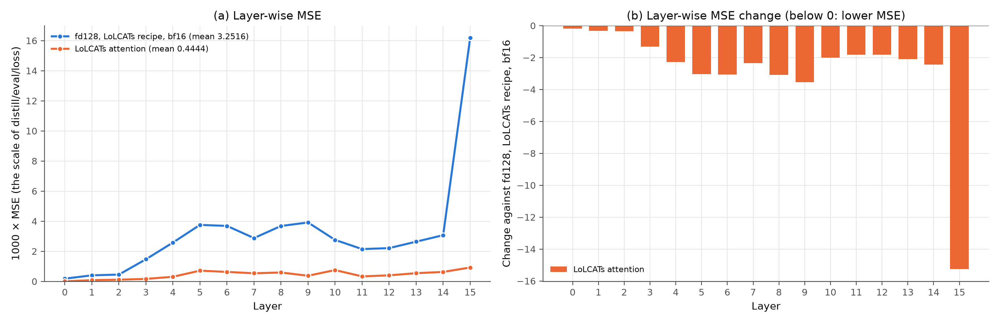
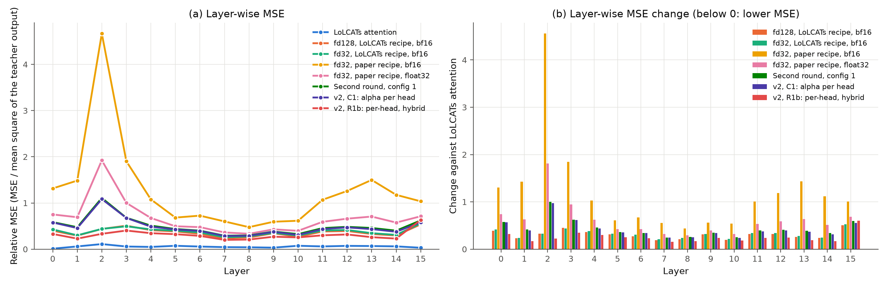

# Experiment: LoLCATs attention as a control in stage 1

**Status:** Run 1 finished on 2026-10-09. Stage 1 validation loss 0.4442 (Lizard: 3.2549), PIQA 73.5 (Lizard: 57.6), ARC-Easy 62.8, MMLU subset 26.0. On PIQA and ARC-Easy, this model computes almost exactly the teacher attention ("Results", finding 2). Run 2 (per-layer table) finished on the same day. On far queries, the window keeps 31–79% of the attention weight. Layer 0 keeps its window, unlike Lizard (finding 8). Run 3 (layer-wise MSE) finished on the same day. The error is lower than for every Lizard run in every layer, by 3.7–37× against Lizard Run 1 (finding 10).

## Question

Does the original LoLCATs attention give a better stage 1 than Lizard, with the same pipeline, data, recipe and harness? This is step A2 of [document 19](../19-next-steps-from-literature.md), for stage 1 only.

The run changes only the attention layer. Thus a clear difference comes from the layer, not from the pipeline. The published LoLCATs results for 1B are after stage 2 (Liger paper: PIQA 74.1, ARC-Easy 63.7, MMLU 23.1). This experiment cannot compare with them. A stage 2 run is a later step.

## What changes, and what stays the same

The reference is the stage 1 checkpoint of Run 1: Lizard with feature dimension 128 and the LoLCATs recipe ([stage difference](stage-difference.md)).

| Part | Lizard, Run 1 stage 1 | This experiment |
|---|---|---|
| Model config | `distill_llama3_2_1b_lizard_w128_fd128_m4` | `distill_llama3_1_1b_lk_smd_wtk64_fd64_w01` (`make lolcats`) |
| Attention type | `lolcats_llama_lizard` | `lolcats_llama_window_tk` |
| Linear branch | A gate (W_γ), all tokens, its own denominator | No gate, only the tokens outside the window, one denominator shared with the window |
| Feature maps | One map for each layer, shared by the 32 heads | One map for each head (32 × 64 × 128) |
| Window | Sliding, 128 tokens, 4 sinks, no RoPE | Terraced: its own block of 128 tokens and the block before it, thus 128–255 tokens. No sinks, with RoPE. |
| Window weight | α for each layer, start value 1 | σ(a_h) for each head, start value 0.1 |
| Start values of the maps | Random, RMS 0.02 | Identity (`--lk_zero_init`) |
| Trainable parameters | 294,992 | Approximately 8.39M (16 layers × (2 × 32 × 64 × 128 + 32)), an estimate |

**The same in both runs:** Llama-3.2-1B in bf16, the Alpaca-cleaned data in chunks of 2048 tokens, and the stage 1 recipe `distill_alpaca_clean_xent0_mse1000_lr1e-2_1b`. The recipe has learning rate 1e-2, the plateau schedule, no warmup, no clipping, 2 epochs and batch 1 × 8. Both runs use the same loss (1000 × MSE of the head outputs before `o_proj`), the same validation data and the same harness. Thus the two validation losses compare directly.

The file name of the model config says `wtk64_fd64`, but the file sets window 128 and feature dimension 128, as for Lizard. The LoLCATs defaults are 64 and 64. This run keeps the file without changes.

## How to run

### Training: HF Jobs (H200)

The current Docker image already has the config and the `make lolcats` target. Thus no new image is necessary.

```bash
make hf-job IMAGE=mahdikhashan/lolcats HF_REPO=nanoman1/lolcats-lizard-llama-3.2-1b HF_FLAVOR=h200 HF_TIMEOUT=2h \
  TARGET=lolcats ARGS="--no_finetune"
```

- The job runs `make lolcats ARGS="--no_wandb --no_finetune"` (with `--no_wandb` only if `WANDB_API_KEY` is not set).
- **Time and cost:** approximately 1 hour and $5. This is an estimate: stage 1 of Run 1 (Lizard, bf16) took approximately 50 minutes ([document 2](../02-compute-and-cost.md)).
- **First check during the run:** `hf jobs logs <job id> | grep -a "Eval step"`. The loss must decrease.
- **Checkpoint on the Hub:** `--lk_zero_init` adds `-lzi=1` to the run name. Thus the path is:

```text
checkpoints/distill_llama3_1_1b_lk_smd_wtk64_fd64_w01/dl-d=distill_alpaca_clean_xent0_mse1000_lr1e-2_1b-m=distill_llama3_1_1b_lk_smd_wtk64_fd64_w01-f=finetune_lora_qkvo_alpaca_clean_1b-s=0-se=0-re=0-lzi=1_distill.pt
```

### Evaluation: the A10 machine

The evaluation needs the change to `scripts/compare_stages.py` of this PR ("Code changes"). Thus first run `git pull`.

```bash
cd /system/user/khashan/lolcats && git pull && conda activate lolcats-env
export HF_TOKEN=<token with access to HF_REPO and meta-llama/Llama-3.2-1B>
CKPT=checkpoints/distill_llama3_1_1b_lk_smd_wtk64_fd64_w01/dl-d=distill_alpaca_clean_xent0_mse1000_lr1e-2_1b-m=distill_llama3_1_1b_lk_smd_wtk64_fd64_w01-f=finetune_lora_qkvo_alpaca_clean_1b-s=0-se=0-re=0-lzi=1_distill.pt

# 1. MMLU subset, PIQA and ARC-Easy of the LoLCATs stage 1 model
MODELS=stage1 TASKS="mmlu_subset piqa arc_easy" MODEL_CONFIG=distill_llama3_1_1b_lk_smd_wtk64_fd64_w01 \
  DISTILL_CKPT="$CKPT" OUT_DIR=results/stages/$(date +%Y%m%d-%H%M%S)-lolcats-control scripts/compare_stages.sh

# 2. Layer-wise MSE, and a plot against Lizard fd128 with the same recipe
python scripts/layer_mse.py compute results/layer_mse/lolcats_attention_fd128.json --label "LoLCATs attention, fd128" \
  --model_config distill_llama3_1_1b_lk_smd_wtk64_fd64_w01 --distill_config distill_alpaca_clean_xent0_mse1000_lr1e-2_1b \
  --checkpoint "$CKPT" --cache_dir ~/.cache/huggingface/hub
python scripts/layer_mse.py plot results/layer_mse/lizard_vs_lolcats_attention \
  docs/experiments/xai-layer-wise-mse/fd128_lolcats.json results/layer_mse/lolcats_attention_fd128.json
```

Note: `fd128_lolcats.json` is Lizard with feature dimension 128 and the LoLCATs recipe. `lolcats_attention_fd128.json` is the LoLCATs attention of this experiment.

**Per-layer table alone** (no benchmark, a few minutes). The task `layers` loads the model, checks the checkpoint and writes the table "LoLCATs parameters and window share" to `summary.md`. The harness stops before a benchmark.

```bash
MODELS=stage1 TASKS=layers MODEL_CONFIG=distill_llama3_1_1b_lk_smd_wtk64_fd64_w01 \
  DISTILL_CKPT="$CKPT" OUT_DIR=results/stages/$(date +%Y%m%d-%H%M%S)-lolcats-control-layers scripts/compare_stages.sh
```

The table uses one 5-shot MMLU prompt of 2048 tokens. For each layer, it gives these values:

| Column | Meaning |
|---|---|
| Window factor mean, min, max | σ(a_h) over the 32 heads, the weight of the window terms before the normalization. Start value 0.1. |
| Window share, all queries | The share of the attention weight of a query on the keys inside its window, as the mean over the heads and the queries |
| Far queries | The same share, only for the queries with keys outside the window (position 256 or later). There, the linear branch acts. |
| Last query | The same share for the last token of the prompt |
| φq, φk RMS / max | The size of the feature-map weights |
| φq, φk change from identity | ‖W − I‖ / ‖I‖. The maps start as identity matrices (`--lk_zero_init`). |

**Reference evaluations** (optional, minutes each). They complete the comparison table below.

```bash
# ARC-Easy of the Lizard reference (Run 1 stage 1): the default paths of compare_stages.sh
MODELS=stage1 TASKS=arc_easy scripts/compare_stages.sh
# The teacher on PIQA and ARC-Easy in this harness (X0 of gap analysis 2)
MODELS=teacher TASKS="piqa arc_easy" scripts/compare_stages.sh
```

## How to compare

| Measure | Lizard, Run 1 stage 1 | LoLCATs attention | Limit for a clear difference |
|---|---|---|---|
| Stage 1 validation loss | 3.2549 | 0.4442 | The same loss and data. No SE. |
| PIQA | 57.6 | 73.5 | Approximately 3.2 points (2 unpaired SE) |
| ARC-Easy | Not measured (reference evaluation above) | 62.8 | Approximately 2.8 points |
| MMLU subset | 22.5, with "A" for 95.4% | 26.0, with "A" for 19.3% | Approximately 7 points. This subset cannot separate the two models. |

| Result | Meaning | Next step |
|---|---|---|
| LoLCATs is clearly better on PIQA or ARC-Easy | With the same pipeline and recipe, the Lizard layer is the weaker part. | Stage 2 for LoLCATs, against the target of the Liger paper. Then steps B1 and B5 of [document 19](../19-next-steps-from-literature.md). |
| No clear difference | Stage 1 alone does not separate the two layers on these tasks, as for the recipe experiments. | Stage 2 for LoLCATs. The published LoLCATs results are after stage 2. |
| LoLCATs is clearly worse | Not expected | First check the run: the loss curve and the checkpoint check. |

## Code changes

`scripts/compare_stages.py`: the stage 1 checkpoint check accepted only Lizard parameter names. A LoLCATs checkpoint thus gave 0 expected keys, and the check had no effect. The new tuple `LOLCATS_PARAMS` adds the three LoLCATs names: `feature_map_q.mlp.layer`, `feature_map_k.mlp.layer` and `window_factors`. `layer_mse.py` uses the same check. The Lizard names do not change.

Second change to `scripts/compare_stages.py` (2026-10-09): the per-layer table at the end of `summary.md` was empty for LoLCATs, because it read only Lizard parameters. `layer_stats` now also reads LoLCATs layers. It gives the window factors, the window share of the attention weight and the change of the feature maps. The share comes from the attention weights that the layer itself returns, so the output of the model does not change. `compare_stages.sh` has the new task `layers`, which writes only the checkpoint check and this table. For Lizard runs, `summary.md` does not change: the summary of R1b is the same as before.

`layer_mse.py` works without a change. It reads `(y_pred, y_true)` from each layer, and the LoLCATs layer gives the same pair.

## Tests

CPU, 2026-10-09. The test ran the exact command of `make lolcats ARGS="--no_wandb --no_finetune ..."` with `distill_llama.main()`. It used a tiny local Llama (3 layers, 4 heads, head dimension 16) and a small Alpaca file. In a copy of the repository, the configs pointed to the tiny model, in float32 and eager attention.

| Check | Result |
|---|---|
| Trainable tensors | Only `feature_map_q.mlp.layer`, `feature_map_k.mlp.layer` and `window_factors` (9 tensors for 3 layers) |
| Start values | The feature maps are identity matrices. σ(window factor) = 0.1 for each head. |
| Training at 1024 tokens, 4 steps, `--gradient_accumulation_steps 1` | The validation loss decreased at each evaluation: 2289, 2224, 2198, 2175. |
| Checkpoint | The name ends in `-se=0-re=0-lzi=1_distill.pt` (the test adds `-gas=1-ms=4`). It holds the 9 tensors. |
| `check_checkpoint` with the change | 9 expected keys, 0 missing, 0 unexpected, 0 not loaded |

**Two notes from the tests:**

- At 256 tokens, the error at the start was approximately 2e-13. The terraced window covers up to 255 tokens, so it covers the whole sequence with exact softmax. The linear branch acts only on longer sequences. The training data has 2048 tokens, so this does not affect the real run.
- At 1024 tokens, on the tiny random model, the error at the start was 2.0–2.4 for LoLCATs and 6.9–7.1 for Lizard. The mean square of the teacher output was 3.2–3.8. The output of LoLCATs is a weighted mean, and the output of Lizard has a total weight above 1 ([document 15](../15-attention-math-side-by-side.md), claim C). These values do not predict the result at 1B.

## Results

### Run 1 (2026-10-09)

- **Training**: stage 1 on HF Jobs (H200) with the command above. These notes do not record the job ID or the time.
- **Evaluation**: `scripts/compare_stages.sh` with `MODELS=stage1`, on `student06`, A10, on 2026-10-09 at 17:50 UTC. Run directory: `results/stages/20261009-194950-lolcats-control`. Code: lolcats `8bd7614`, harness `b281b09`, torch 2.5.1, transformers 4.43.1.
- **Files in the repository**: [`lolcats-control/stage1-eval/`](lolcats-control/stage1-eval/), the run directory without the `eval.log` files. It has `summary.md`, `summary.json` and `env.txt`. For each task, it has `results.json`, `checkpoints.json`, `lizard.json` and the answer to each question.

| Checkpoint | SHA-256 | Size | Parameters | Dtype | Stored step | Stored loss |
|---|---|---|---|---|---|---|
| LoLCATs attention, stage 1 | `200d27aa5393c1465c3f203639ad24ea2a791c0a54ee1f2a295776bcc0ee3c08` | 16,808,818 B | 8,389,120 | bfloat16 (48 tensors) | 1100 | **0.4442** |

In all three evaluations, the 48 expected tensors (16 layers × 3) loaded with their values. The stored step is the last evaluation, as in all earlier runs.

**Scores** (z values with unpaired SEs):

| Measure | Lizard, Run 1 stage 1 | LoLCATs attention, stage 1 | Difference |
|---|---|---|---|
| Stage 1 validation loss | 3.2549 | **0.4442** | −86% (7.3× lower) |
| PIQA | 57.6 ± 1.2 | **73.5 ± 1.0** | +15.9 points, z ≈ 10 |
| ARC-Easy | 39.0 ± 1.0 (normalized 37.8), measured on 2026-10-10 ([RoPE in the window branch](window-rope.md)) | **62.8 ± 1.0** (normalized 58.0) | +23.8 points, z ≈ 17 |
| MMLU subset | 22.5 ± 2.5 | 26.0 ± 2.6 | +3.5 points, z ≈ 1.0 |
| "A" / "B" / "C" / "D" on MMLU | 95.4% / 2.8% / 1.8% / 0.0% | 19.3% / 14.7% / 42.8% / 23.2% | – |
| Letter mass, confidence, entropy | 0.018, 0.586, 1.550 bits ([temperature](temperature.md)) | 0.962, 0.450, 1.746 bits | – |

**Other reference values:**

| Model | PIQA | ARC-Easy |
|---|---|---|
| LoLCATs attention, stage 1 (this run) | 73.5 | 62.8 |
| Lizard model after stage 2 (Run 2, [document 7](../07-results.md)) | 67.95 | 54.8 |
| Lizard, best stage 1 on ARC-Easy (config 1, [second round](second-round.md)) | 57.3 | 36.5 |
| Teacher, Lizard paper (another harness) | 74.1 | 65.4 |
| Lizard 1B, Lizard paper | 74.8 | 65.6 |
| LoLCATs 1B after stage 2, Liger paper | 74.1 | 63.7 |

**Finding 1: the pipeline can train a much better model than the Lizard runs**. LoLCATs after stage 1 is 15.9 points above Lizard after stage 1 on PIQA. Without stage 2, it is also above the final Lizard model on PIQA (+5.5, z ≈ 3.8) and on ARC-Easy (+8.0, z ≈ 5.6). The pipeline, the data, the recipe and the harness are the same. Thus the gap on these tasks comes from the Lizard layer. This is the first row of "How to compare".

**Finding 2: on PIQA and ARC-Easy, this model computes almost exactly the teacher attention**. The terraced window gives exact softmax attention with RoPE over up to 255 tokens. The linear branch acts only on tokens farther back. 95% of the PIQA and ARC-Easy prompts have fewer than approximately 90 tokens ([document 13](../13-lizard-attention-v2.md), an estimate). For such a prompt, the window factor cancels, and the output is the softmax attention of the teacher, up to rounding. Thus these two scores test the window, not the linear attention. They are probably near the teacher scores in this harness. X0 of [gap analysis 2](../12-gap-analysis-2.md) has not run yet and can check this.

**Finding 3: LoLCATs also approximates long sequences much better**. The stage 1 loss uses sequences of 2048 tokens, so the linear branch acts on most positions. The loss is 7.3× lower than for Lizard. Two differences explain a part of this: the larger window (128–255 tokens against 128) and the feature maps for each head (28× more parameters). This run cannot separate the causes.

**Finding 4: MMLU stays near chance, but without the "A" collapse**. The 5-shot prompts are long, so the linear branch acts. The accuracy is 26.0, against 33.7 for the teacher (z ≈ −2.0). This agrees with the Liger paper (LoLCATs 1B: 23.1 after stage 2). But the model puts 96.2% of its probability on the four letters, against 1.8% for Lizard stage 1. Thus the LoLCATs model keeps the answer format, and Lizard stage 1 does not ("Stuck on A", [document 19](../19-next-steps-from-literature.md)).

**Finding 5: the most probable cause of the short-context gap of Lizard**. On a short prompt, Lizard never computes the teacher attention. Its window has no RoPE, and its gated branch adds weight on every token, also inside the window ([document 15](../15-attention-math-side-by-side.md), claims B, C and F). LoLCATs computes the teacher attention on a short prompt, because its window has RoPE and its linear branch excludes the window tokens.

### Run 2: per-layer table (2026-10-09)

- **Command**: `MODELS=stage1 TASKS=layers` of `scripts/compare_stages.sh` with the checkpoint of Run 1 ("Per-layer table alone" above). No benchmark.
- **Machine and code**: `student06`, A10, on 2026-10-09 at 18:25 UTC. Run directory: `results/stages/20261009-202521-lolcats-control-layers`. Code: lolcats `e5e0e9d`, harness `b281b09`.
- **Checkpoint**: the checkpoint of Run 1 (SHA-256 `200d27aa…`, stored loss 0.4442). All 48 expected tensors loaded with their values.
- **Prompt**: one 5-shot prompt of `hendrycksTest-high_school_us_history`, 2048 tokens. Thus the far queries are the positions 256–2047.
- **Files in the repository**: [`lolcats-control/stage1-layers/`](lolcats-control/stage1-layers/), with `summary.md`, `summary.json`, `env.txt`, `checkpoints.json` and `lizard.json`.

| Layer | Window factor mean | Min | Max | Window share, all queries | Far queries | Last query | φq RMS / max | φk RMS / max | φq change from identity | φk change from identity |
|---|---|---|---|---|---|---|---|---|---|---|
| 0 | 0.116 | 0.102 | 0.134 | 0.818 | 0.792 | 0.757 | 0.146 / 1.80 | 0.138 / 1.46 | 1.325 | 1.191 |
| 1 | 0.092 | 0.066 | 0.110 | 0.439 | 0.359 | 0.336 | 0.165 / 3.31 | 0.169 / 2.08 | 1.628 | 1.651 |
| 2 | 0.096 | 0.080 | 0.107 | 0.399 | 0.313 | 0.335 | 0.185 / 3.72 | 0.159 / 1.86 | 1.906 | 1.525 |
| 3 | 0.101 | 0.051 | 0.128 | 0.516 | 0.447 | 0.336 | 0.240 / 3.48 | 0.151 / 2.03 | 2.576 | 1.432 |
| 4 | 0.107 | 0.070 | 0.124 | 0.623 | 0.569 | 0.509 | 0.240 / 4.12 | 0.157 / 2.03 | 2.585 | 1.497 |
| 5 | 0.109 | 0.060 | 0.125 | 0.755 | 0.720 | 0.692 | 0.259 / 4.28 | 0.188 / 4.09 | 2.811 | 1.896 |
| 6 | 0.113 | 0.102 | 0.129 | 0.782 | 0.751 | 0.756 | 0.232 / 3.06 | 0.184 / 3.14 | 2.467 | 1.850 |
| 7 | 0.111 | 0.085 | 0.129 | 0.802 | 0.774 | 0.644 | 0.249 / 4.03 | 0.169 / 2.09 | 2.696 | 1.695 |
| 8 | 0.111 | 0.078 | 0.129 | 0.772 | 0.739 | 0.777 | 0.236 / 4.00 | 0.176 / 4.00 | 2.534 | 1.794 |
| 9 | 0.106 | 0.071 | 0.118 | 0.768 | 0.735 | 0.717 | 0.226 / 3.55 | 0.166 / 3.38 | 2.416 | 1.620 |
| 10 | 0.100 | 0.050 | 0.130 | 0.687 | 0.642 | 0.583 | 0.227 / 3.50 | 0.254 / 3.52 | 2.427 | 2.723 |
| 11 | 0.104 | 0.084 | 0.118 | 0.609 | 0.553 | 0.549 | 0.257 / 3.00 | 0.170 / 2.03 | 2.770 | 1.691 |
| 12 | 0.095 | 0.059 | 0.110 | 0.520 | 0.451 | 0.440 | 0.230 / 4.22 | 0.178 / 2.86 | 2.451 | 1.791 |
| 13 | 0.103 | 0.076 | 0.135 | 0.521 | 0.453 | 0.429 | 0.218 / 4.06 | 0.170 / 2.55 | 2.327 | 1.702 |
| 14 | 0.101 | 0.075 | 0.129 | 0.558 | 0.495 | 0.613 | 0.228 / 4.38 | 0.173 / 2.08 | 2.436 | 1.762 |
| 15 | 0.097 | 0.067 | 0.130 | 0.562 | 0.499 | 0.490 | 0.228 / 3.16 | 0.176 / 2.00 | 2.429 | 1.767 |

**Finding 6: the window factors stay near their start value**. The layer means are 0.092–0.116, and the single heads are 0.050–0.135. The start value is 0.1. Thus the differences between the layers do not come from the window factors. They come from the scores of the window and from the feature maps.

**Finding 7: the linear branch carries 21–69% of the weight on far queries**. On these queries, the window keeps 31–79% of the weight (mean over the layers: 0.58). The linear branch carries the most weight in layers 1–3 (55–69%) and the least in layer 0 and layers 5–9 (21–28%). Thus on long prompts, such as the 5-shot MMLU prompts, the linear branch has a large part in every layer.

**Finding 8: layer 0 differs from Lizard**. Over layers 1–15, the window share on far queries follows α of Lizard Run 1 stage 1 ([stage difference](stage-difference.md), finding 2). The rank correlation is 0.79. Over all 16 layers, it is 0.48. In layer 0, LoLCATs gives its window the largest share (0.79). Lizard gave its window almost no weight there (α = 0.042). This agrees with claim F of [document 15](../15-attention-math-side-by-side.md). A window without RoPE cannot give the local attention of layer 0, so the training of Lizard reduces its weight. With RoPE, the LoLCATs window keeps this task. α is a weight and not a share, so only the order of the layers compares.

**Finding 9: the feature maps moved far from the identity**. The change ‖W − I‖ / ‖I‖ is 1.3–2.8 for φq and 1.2–2.7 for φk. φq changed more than φk in 14 of the 16 layers. Layer 0 changed least. The RMS rose from 0.088 (the identity) to 0.14–0.26.

### Run 3: layer-wise MSE (2026-10-09)

- **Command**: `scripts/layer_mse.py compute` with the checkpoint of Run 1, then `plot` against the 7 Lizard results of [XAI: layer-wise MSE](xai-layer-wise-mse.md) ("Evaluation" above).
- **Machine and code**: `student06`, A10, lolcats `e523d45`, bf16 (the dtype of the model config).
- **Data**: all 16 batches of the stage 1 validation data (32,768 tokens), the same data as for the Lizard results. Each layer gets the teacher input.
- **Check**: the script gives 0.4444 against the stored loss 0.4442 (+0.044%). The bf16 checkpoints of Lizard gave −0.10% to −0.21%. All 48 expected tensors loaded.
- **Files in the repository**: [`lolcats_attention_fd128.json`](xai-layer-wise-mse/lolcats_attention_fd128.json) and four plots in [`xai-layer-wise-mse/`](xai-layer-wise-mse/).

The reference is Lizard Run 1 stage 1 (fd128, the same recipe and precision). MSE is 1000 × MSE, the scale of the stage 1 loss. Relative MSE is the MSE divided by the mean square of the teacher output.

| Layer | MSE, Lizard | MSE, LoLCATs | Lizard ÷ LoLCATs | Relative MSE, Lizard | Relative MSE, LoLCATs |
|---|---|---|---|---|---|
| 0 | 0.1816 | 0.0049 | 36.9 | 0.400 | 0.011 |
| 1 | 0.4046 | 0.0818 | 4.9 | 0.293 | 0.059 |
| 2 | 0.4522 | 0.1139 | 4.0 | 0.438 | 0.110 |
| 3 | 1.470 | 0.1661 | 8.8 | 0.509 | 0.057 |
| 4 | 2.582 | 0.3057 | 8.4 | 0.411 | 0.049 |
| 5 | 3.755 | 0.7148 | 5.3 | 0.385 | 0.073 |
| 6 | 3.687 | 0.6297 | 5.9 | 0.332 | 0.057 |
| 7 | 2.880 | 0.5409 | 5.3 | 0.235 | 0.044 |
| 8 | 3.683 | 0.5914 | 6.2 | 0.254 | 0.041 |
| 9 | 3.917 | 0.3755 | 10.4 | 0.345 | 0.033 |
| 10 | 2.759 | 0.7529 | 3.7 | 0.270 | 0.074 |
| 11 | 2.147 | 0.3338 | 6.4 | 0.382 | 0.059 |
| 12 | 2.212 | 0.4020 | 5.5 | 0.393 | 0.071 |
| 13 | 2.639 | 0.5455 | 4.8 | 0.328 | 0.068 |
| 14 | 3.072 | 0.6286 | 4.9 | 0.296 | 0.061 |
| 15 | 16.19 | 0.9232 | 17.5 | 0.537 | 0.031 |
| Mean (the loss) | 3.2516 | 0.4444 | 7.3 | – | – |





**Finding 10: LoLCATs has a lower error in every layer, against every Lizard run**. Against Lizard Run 1, the MSE is 3.7× (layer 10) to 36.9× (layer 0) lower. The relative MSE is 1.1–11.0%, against 23.5–53.7% for Lizard. For all 7 Lizard checkpoints, each layer has at least 3.0× the MSE of LoLCATs. The loss of the best Lizard run (R1b, 3.0542) is 6.9× the loss of LoLCATs.

**Finding 11: layer 15 is a problem of Lizard, not of the teacher**. In Lizard, layer 15 gives 31.1% of the loss, and heads 14 and 23 alone give 21.4%. In LoLCATs, layer 15 gives 13.0% of the loss, and its relative MSE (3.1%) is the second lowest of all layers. Heads 14 and 23 have an MSE of 1.29 and 3.03, against 211.4 and 144.2 for Lizard. Together they give 1.9% of the loss. Thus the teacher heads are not hard to approximate. The limit for each head of Lizard ([gap analysis 2](../12-gap-analysis-2.md), section 3) is the more probable cause.

**Finding 12: layer 0 has the largest difference**. Its MSE is 36.9× lower than for Lizard, with a relative MSE of 1.1%. This agrees with finding 8: with RoPE, the window of LoLCATs gives the local attention of layer 0, but the window of Lizard cannot.

**Limits of this comparison**: each layer gets the teacher input, so the error of one layer does not reach the next layer. The window of LoLCATs is larger (128–255 tokens against 128), and its feature maps have 28× more parameters. This run cannot separate these causes from the form of the attention.

### Next steps

1. X0: the teacher on PIQA and ARC-Easy in this harness (minutes). It checks finding 2.
2. Lizard with `window_rope` in the setup of Run 1 (step B5 of [document 19](../19-next-steps-from-literature.md)). This is the most direct test of findings 5 and 8. It needs only a new model config: the Run 1 config with `attention_type: lolcats_llama_lizard_v2` and `window_rope: true`. With RoPE, α of layer 0 must stay high, as the window share of LoLCATs does.
3. A Lizard option that keeps the gated branch out of the window, as in LoLCATs (claim A of [document 15](../15-attention-math-side-by-side.md)). It needs a code change.
4. Stage 2 of this LoLCATs model, against the target of the Liger paper (MMLU 23.1).
5. ARC-Easy of Lizard Run 1 stage 1 (the reference evaluation above), to fill the empty cell.
