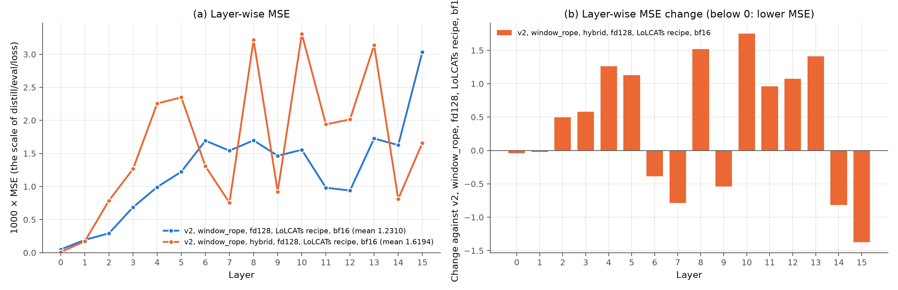
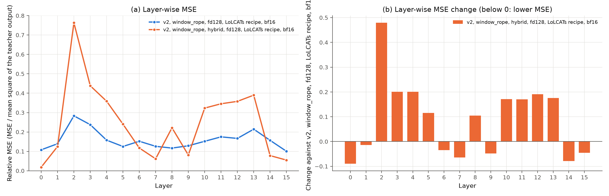
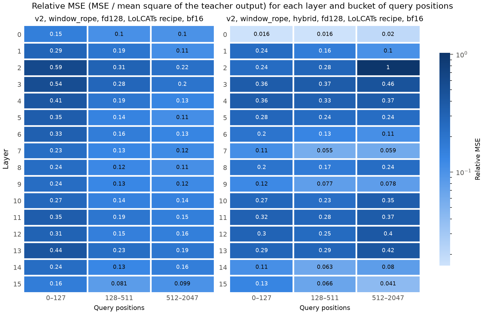
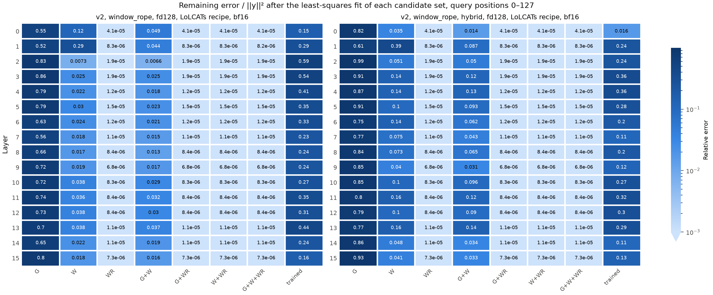
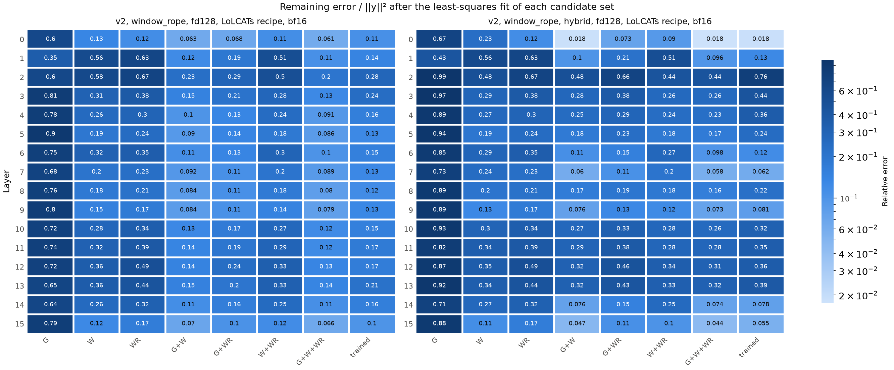

# Experiment: `window_rope` with the shared denominator (`gla_norm: hybrid`)

**Status:** Stage 1 finished on 2026-10-10. Validation loss 1.6172 (`window_rope`: 1.2290). PIQA 58.9 (`window_rope`: 61.5), ARC-Easy 36.0 (`window_rope`: 43.3), MMLU subset 25.3. Thus `hybrid` does not help in this setup. The gate closed in 9 of 16 layers, and these layers lost the long range. In the 7 layers with an open gate, the MSE decreased at all positions ("Results", findings 3 to 6).

## Question

Does the shared denominator of `gla_norm: hybrid` give a better mix of the two branches than `gla_norm: row`, in the `window_rope` setup? Does this mix lower the error at short positions, and increase PIQA and ARC-Easy over `window_rope`?

This is the next run of the decision rules of [RoPE in the window branch](window-rope.md).

## Why this change

| Evidence | Source |
|---|---|
| With RoPE, the window branch gives almost the teacher output at positions 0–127. W alone keeps an error of 0.048 there, with the best weight for each head. | [RoPE in the window branch](window-rope.md), finding 5 |
| At positions 0–127, the trained output has 13× the error of the best mix of the same two branches (0.321 against 0.025) | [RoPE in the window branch](window-rope.md), finding 6 |
| The best weight of the gated branch increases with the position: 0.08 at positions 0–127, 0.65 at 128–511 and 0.79 at 512–2047. With `row`, it is always 1. | [RoPE in the window branch](window-rope.md), finding 7 |
| The loss decreased by 62%, but PIQA closed only 25% of the gap to LoLCATs, and ARC-Easy 18% | [RoPE in the window branch](window-rope.md), finding 2 |
| With `hybrid`, the best weight of the gated branch over all positions was 0.98 (R1b), against 0.55–0.81 with `row` | [XAI: branch decomposition](xai-branch-fit.md), finding 7 |
| LoLCATs uses this scaling, with a window with RoPE. PIQA is 73.5 after stage 1. Its linear branch covers only the keys outside the window. | [LoLCATs control](lolcats-control.md), [document 13](../13-lizard-attention-v2.md) |
| Document 20 recommends the shared denominator together with the window steps | [Document 20](../20-layer-mse-for-piqa-arc.md), section 5 |

## What `hybrid` computes

Let $w_{ij} = \phi(q_i)^\top \phi(k_j)\, \Gamma_{ij}$ be the gated weights over all keys $j \le i$. Let $s_{ij}$ be the window scores with RoPE over the 128 keys of the window. Let $t_k$ be the 4 sink logits. Let $m_i$ be the larger of $\max_j s_{ij}$ and $\max_k t_k$.

- **`row` (`window_rope`):** $y_i = \sum_j \frac{w_{ij}}{\sum_l w_{il}} v_j + \alpha \sum_j p_{ij} v_j$. Here $p_{ij}$ is the softmax over the window scores and the sinks. The gated branch has the weight 1 at each position.
- **`hybrid` (this experiment):** one denominator for both branches and the sinks:

```math
y_i = \frac{\sum_j w_{ij} v_j + |\alpha| \sum_{j \in \text{window}} e^{s_{ij} - m_i} v_j}{\sum_j w_{ij} + |\alpha| \left( \sum_{j \in \text{window}} e^{s_{ij} - m_i} + \sum_k e^{t_k - m_i} \right)}
```

The share of the gated branch is its part of the denominator. In `window_rope`, the gate of layers 1–15 stays above 0.999 for 99.9–100% of the tokens of a 2048-token MMLU prompt. With such a gate, $\sum_j w_{ij}$ has one term for each key, so it grows with the position. The window sum has at most 128 terms. Thus with `hybrid`, the share of the gated branch can increase with the position, as finding 7 asks. At short positions, the share depends on the ratio of $\sum_j w_{ij}$ to $|\alpha|$ times the window sum. The training must set this ratio.

## What changes, and what stays the same

| Setting | `window_rope` | This experiment |
|---|---|---|
| Model config | [`distill_llama3_2_1b_lizard_v2_w128_fd128_m4_windowrope`](../../configs/model/distill_llama3_2_1b_lizard_v2_w128_fd128_m4_windowrope.yaml) | [`distill_llama3_2_1b_lizard_v2_w128_fd128_m4_windowrope_hybrid`](../../configs/model/distill_llama3_2_1b_lizard_v2_w128_fd128_m4_windowrope_hybrid.yaml) |
| **`gla_norm`** | **`row`** | **`hybrid`** |
| **Start value of α (`alpha_init`)** | **1.0** | **0.1** |
| RoPE in the window branch | Yes | Yes |
| Feature dimension, window, sinks | 128, 128, 4 | The same |
| One α, one map and one gate for each layer | Yes | The same |
| Precision, stage 1 recipe, data | bf16, LoLCATs recipe, Alpaca | The same |

**Why the start value of α changes too.** With `hybrid`, α sets the share of the gated branch at the start.

- With α = 0.1, the gated branch has a share of 0.05–0.39 at the start values ([document 13](../13-lizard-attention-v2.md), P6). The measurement used 1B sizes, random q and k, and 1,024 tokens.
- With the same inputs, α = 1.0 gives 0.005–0.06. The share is $r / (r + \alpha)$, where $r$ does not depend on α. Thus the conversion is exact ("Tests").
- With a share near 0, the gated branch has almost no effect on the output at the start. For this reason, run R1 with `joint` stopped ([document 13](../13-lizard-attention-v2.md), P6).
- 0.1 is the start value of the window factor of LoLCATs, and R1b used it with `hybrid`.

Thus this run changes one part, the mix of the branches, with two settings. A run with `hybrid` and α = 1.0 would test the start value alone.

## Predictions

Reference values from `window_rope` ([RoPE in the window branch](window-rope.md), findings 6–9). They convert the relative errors of the branch decomposition into a stage 1 loss, as in [RoPE in the window branch](window-rope.md), "Predictions":

| Mix of the `window_rope` branches | Estimated stage 1 loss |
|---|---|
| The trained output (`row`) | 1.23 |
| The best weights for each head, one weight for all positions | 0.89 |
| The best weights for each head and each position bucket (0–127, 128–511, 512–2047) | 0.71 |
| LoLCATs attention (trained, for comparison) | 0.44 |

1. **Stage 1 loss:** below 1.229. A loss near 0.71 means that `hybrid` finds the best mix in each position bucket. The branches also train, so the loss can also go below 0.71.
2. **Short positions:** the relative MSE of positions 0–127 decreases clearly from 0.321, probably below 0.2. Positions 0–127 are no longer the bucket with the largest error.
3. **Mixing gap at positions 0–127:** the trained output has less than 3× the error of the best G+W mix (`window_rope`: 13×).
4. **α:** at the end, α is above its start value 0.1 in most layers. With RoPE, the window carries most of the teacher output at short positions. In R1b, without RoPE, the mean \|α\| of each layer fell to 0.009–0.072.
5. **Accuracy:** PIQA and ARC-Easy increase over `window_rope` (61.5 and 43.3). A clear gain needs approximately 3.2 points on PIQA and 2.9 points on ARC-Easy (2 unpaired SE).
6. **MMLU subset:** no prediction. The subset cannot separate differences of a few points ([LoLCATs control](lolcats-control.md), "How to compare").

## Risks

- **The window can switch off, as in R1b.** In R1b, the mean \|α\| of each layer fell below its start value 0.1. ARC-Easy fell to 29.9. R1b had no RoPE in the window, so the window was less useful. If α falls below 0.1 here too, this risk is real (prediction 4).
- **The sinks take a part of each row.** With `hybrid`, the sink terms are in the shared denominator. Thus each row sums to less than 1 ([document 13](../13-lizard-attention-v2.md), check 5). With `row`, only the window part has this property.
- **The gated branch still covers the keys inside the window.** `hybrid` can make its share small at short positions, but not 0. Step 3 of [document 20](../20-layer-mse-for-piqa-arc.md) removes these keys from the gated branch.
- **Thesis:** `hybrid` is the scaling of LoLCATs. Report this run as an extension, as `window_rope` ([document 19](../19-next-steps-from-literature.md), part B).

## How to run

### 1. A new Docker image

The job runs the code inside the image, and the image does not have the new config yet ([document 3](../03-infrastructure.md)). After the merge, select Actions → "Docker image" → Run workflow on GitHub.

### 2. Stage 1 on HF Jobs

```bash
make hf-job IMAGE=mahdikhashan/lolcats HF_REPO=nanoman1/lolcats-lizard-llama-3.2-1b HF_FLAVOR=a100-large HF_TIMEOUT=6h \
  ARGS="--model_config distill_llama3_2_1b_lizard_v2_w128_fd128_m4_windowrope_hybrid --no_finetune"
```

- **Time and cost:** `window_rope` used the same flavor and timeout. It trained at 1.24 sequences each second, thus approximately 2.5 hours and $6 ([RoPE in the window branch](window-rope.md)). `hybrid` uses the same dense calculation, so the time is probably the same.
- **Early check:** `hf jobs logs <job id> | grep -a "Eval step"`. Compare each value with the curve of `window_rope`:

| Step | 100 | 200 | 300 | 400 | 500 | 600 | 1000 | 1100 |
|---|---|---|---|---|---|---|---|---|
| `window_rope` | 2.0879 | 1.7700 | 1.6123 | 1.5103 | 1.4014 | 1.3315 | 1.2480 | 1.2290 |

- **Checkpoint on the Hub:**

```text
checkpoints/distill_llama3_2_1b_lizard_v2_w128_fd128_m4_windowrope_hybrid/dl-d=distill_alpaca_clean_xent0_mse1000_lr1e-2_1b-m=distill_llama3_2_1b_lizard_v2_w128_fd128_m4_windowrope_hybrid-f=finetune_lora_qkvo_alpaca_clean_1b-s=0-se=0-re=0_distill.pt
```

### 3. Evaluation and XAI on `student06` (A10)

Set the GPU variables in the shell that runs the commands, for example inside the `tmux` session. The check must print one A10.

```bash
cd /system/user/khashan/lolcats && git pull && conda activate lolcats-env
export CUDA_DEVICE_ORDER=PCI_BUS_ID CUDA_VISIBLE_DEVICES=0
python -c "import torch; print(torch.cuda.device_count(), torch.cuda.get_device_name(0))"  # 1 NVIDIA A10
MC=distill_llama3_2_1b_lizard_v2_w128_fd128_m4_windowrope_hybrid
DC=distill_alpaca_clean_xent0_mse1000_lr1e-2_1b
CACHE=$HOME/.cache/huggingface/hub
OUT=results/window_rope_hybrid && mkdir -p $OUT

# 1. Benchmarks
MODELS=stage1 TASKS="mmlu_subset piqa arc_easy" MODEL_CONFIG=$MC OUT_DIR=$OUT/stages scripts/compare_stages.sh

# 2. XAI: layer-wise MSE, MSE by token position, branch decomposition
python scripts/layer_mse.py compute $OUT/layer_mse.json --model_config $MC --distill_config $DC \
  --label "v2, window_rope, hybrid, fd128, LoLCATs recipe, bf16" --cache_dir $CACHE
python scripts/position_mse.py compute $OUT/position_mse.json --from_json $OUT/layer_mse.json --cache_dir $CACHE
python scripts/branch_fit.py compute $OUT/branch_fit.json --from_json $OUT/layer_mse.json --cache_dir $CACHE

# 3. Plots against window_rope
WR=docs/experiments
python scripts/layer_mse.py plot $OUT/layer_mse_vs_window_rope $WR/xai-layer-wise-mse/v2_window_rope.json $OUT/layer_mse.json
python scripts/layer_mse.py plot $OUT/layer_mse_vs_window_rope_relative $WR/xai-layer-wise-mse/v2_window_rope.json \
  $OUT/layer_mse.json --relative
python scripts/position_mse.py heatmap $OUT/position_heatmap $WR/xai-position-mse/v2_window_rope.json $OUT/position_mse.json
for bucket in 0-127 all; do
  python scripts/branch_fit.py plot $OUT/branch_fit_$bucket $WR/xai-branch-fit/v2_window_rope.json $OUT/branch_fit.json --bucket $bucket
done

zip -r window-rope-hybrid-$(date +%Y%m%d-%H%M).zip $OUT
```

- `compare_stages.sh` finds the checkpoint from `MODEL_CONFIG` and the default recipe. It downloads a missing checkpoint from `HF_REPO`.
- **Branch decomposition with `hybrid`:** G and W are the two branches with the shared denominator, and W is without |α|. If the trained mix is the best mix, the best weights are 1 for G and |α| for W.

## Tests

CPU, 2026-10-10.

| Check | Result |
|---|---|
| The config against `window_rope` | The model section is equal. In the attention section, only `gla_norm` (`hybrid`) and `alpha_init` (0.1) differ. |
| `pytest tests/test_lizard_attention_v2.py` | 60 passed. They include `hybrid` against the loop reference and the decode form (checks 2 and 3). They also include the gated share at the start values (check 10) and \|α\| (check 11). |
| The share of the gated branch for α = 1.0, from the share for α = 0.1 | One layer of the test model, window 32, 128 positions, the same feature maps. The formula $r / (r + \alpha)$ gives the share for α = 1.0 from the share for α = 0.1. The largest difference is 4.4e-16. |
| Training of a tiny copy of the config (3 layers, window 16, feature dimension 8). The real stage 1 recipe, sequences of 1024 tokens, 8 steps. | The validation loss decreased at each evaluation: 4444, 4271, 4141. α increased from 0.1 to 0.157–0.158 in the 3 layers. The checkpoint has 15 Lizard tensors (3 layers × 5). It loads with 0 missing and 0 unexpected keys, and `layer_mse.py` reproduces its stored loss. `branch_fit.py` reproduces the output of the checkpoint with a relative error of 8.0e-8. |
| Check after the run (2026-10-10): the eval path of lm-eval | A tiny `LolcatsLlamaForCausalLM` (2 layers, window 8, 40 tokens) with the `row` config of `window_rope` and with this config. Random, open (γ ≈ 1) and closed (γ ≈ 0) gates, float32 and bf16. `use_cache=True` gives the same logits as `use_cache=False` (difference 0). Decoding token by token in bf16 differs by up to 1.4e-3 with `hybrid` (0 with `row`). lm-eval does not use this path. |

The values of the tiny model do not predict the values at 1B. After the training, `distill_llama.py` stopped with the known error of the tiny tokenizer in the sample generation (`token_type_ids`, [RoPE in the window branch](window-rope.md), "Tests").

## Results

### Run 1: stage 1 and evaluation (2026-10-10)

- **Training:** HF Jobs, the command of "How to run". This document does not have the validation losses of the job log. The checkpoint holds step 1100.
- **Evaluation:** `student06`, one A10, lolcats `84228c5`. The commands are the block of "How to run", section 3. The XAI scripts used all 16 validation batches (32,768 tokens).
- **Checks:**
  1. In each evaluation, all 80 expected Lizard tensors loaded. 0 missing, 0 unexpected.
  2. `layer_mse.py` gives the loss 1.6194, against the stored loss 1.6172 (+0.14%).
  3. The position buckets add up to the MSE over all positions, with a relative difference of 5.0e-8.
  4. The branches reproduce the checkpoint output with a relative error of 1.7e-3 (bf16 rounding).
  5. lm-eval uses the model with `use_cache=True`. In a tiny model with this config, this path gives the same logits as the training path. This holds in float32 and in bf16, with an open, a closed and a random gate. Thus the scores evaluate the trained model ("Tests").
- **Files in [`window-rope-hybrid/`](window-rope-hybrid/):** the [evaluation summary](window-rope-hybrid/stages.md) and its lm-eval CSV file. The folder also has the plots with their tables. The JSON files are `v2_window_rope_hybrid.json` in the folders of the three XAI documents.

#### Scores

z values with unpaired SEs.

| Measure | `window_rope` | `window_rope` + `hybrid` | Difference | LoLCATs attention |
|---|---|---|---|---|
| Stage 1 validation loss | **1.2290** | 1.6172 | +32% | 0.4442 |
| PIQA | **61.5 ± 1.1** | 58.9 ± 1.1 | −2.6 points, z ≈ −1.6 | 73.5 |
| PIQA, normalized | 58.8 ± 1.1 | 58.5 ± 1.1 | −0.3 points | – |
| ARC-Easy | **43.3 ± 1.0** | 36.0 ± 1.0 | −7.3 points, z ≈ −5.1 | 62.8 |
| ARC-Easy, normalized | 41.0 ± 1.0 | 35.3 ± 1.0 | −5.7 points | 58.0 |
| MMLU subset | 24.6 ± 2.5 | 25.3 ± 2.6 | +0.7 points | 26.0 |
| "A" / "B" / "C" / "D" on MMLU | 40.0% / 20.4% / 16.5% / 23.2% | 26.3% / 11.9% / 27.0% / 34.7% | – | 19.3% / 14.7% / 42.8% / 23.2% |
| Letter mass, confidence, entropy | 0.498, 0.743, 0.963 bits | 0.743, 0.472, 1.706 bits | – | 0.962, 0.450, 1.746 bits |

#### Lizard parameters

From the gate table of the evaluation summary. The table uses one 5-shot MMLU prompt of 2048 tokens.

| Group | Layers | Gate γ | α | Gated weight kept after 512 tokens |
|---|---|---|---|---|
| Open gate | 0, 1, 6, 7, 9, 14, 15 | Above 0.999 for 95.6–100% of the tokens | 0.022–0.151 | 0.94–1.0 |
| Closed gate | 2, 3, 4, 5, 8, 10, 11, 12, 13 | Below 0.001 for 99.2–100% of the tokens | 0.111–0.215 | 0 |

In `window_rope`, the gate of layers 1–15 stayed above 0.999 for 99.9–100% of the tokens.

#### Plots











#### Means over the layers

Relative MSE: the MSE divided by the mean square of the teacher output. Branch fits: the remaining error divided by ‖y‖², with the best weights for each head.

| Measure | `window_rope` | `window_rope` + `hybrid` |
|---|---|---|
| Relative MSE, positions 0–127 | 0.321 | 0.222 |
| Relative MSE, positions 128–511 | 0.168 | 0.188 |
| Relative MSE, positions 512–2047 | 0.141 | 0.273 |
| Open-gate layers: relative MSE 0–127 / 128–511 / 512–2047 | 0.235 / 0.132 / 0.120 | 0.133 / 0.082 / 0.070 |
| Closed-gate layers: relative MSE 0–127 / 128–511 / 512–2047 | 0.388 / 0.195 / 0.158 | 0.292 / 0.270 / 0.430 |
| Trained output against the best G+W mix, positions 0–127 | 13× | 3.0× |
| Trained output against the best G+W mix, all positions | +37% | +31% |

#### Findings

**Finding 1: `hybrid` lowers ARC-Easy clearly and PIQA a little**. ARC-Easy falls by 7.3 points (z ≈ −5.1), and PIQA by 2.6 points (z ≈ −1.6). The stage 1 loss increases by 32%, from 1.229 to 1.617.

**Finding 2: on MMLU, the answers are spread over the four letters, but the accuracy stays at chance**. The share of "A" falls to 26.3%. The letter mass (0.743) and the entropy (1.706 bits) come near the values of LoLCATs (0.962 and 1.746 bits). The accuracy is 25.3%.

**Finding 3: the gate splits the layers into two groups**. In 7 layers, the gate stays open, as in `window_rope`. In the other 9 layers, the gate closes: γ is below 0.001 for almost all tokens. Then the gated branch keeps only the current token. Such a layer is a window attention with sinks, plus a term for the current token. In the closed-gate layers, α increased from 0.1 to 0.111–0.215. In the open-gate layers, α is 0.022–0.151.

**Finding 4: where the gate stays open, `hybrid` lowers the MSE at all positions**. In the 7 open-gate layers, the MSE is 0.17–0.90× that of `window_rope`. The relative MSE decreases in all three buckets, for example from 0.120 to 0.070 at positions 512–2047. Layer 0 has 5.8× less MSE than in `window_rope`, and only 1.7× that of LoLCATs.

**Finding 5: where the gate closes, the layer loses the long range**. In the 9 closed-gate layers, the MSE is 1.8–2.7× that of `window_rope`. These layers give 78% of the loss. Their relative MSE at positions 512–2047 increases from 0.158 to 0.430, and in layer 2 from 0.223 to 1.033. In the branch decomposition over all positions, G alone keeps an error of 0.82–0.99 in these layers. G+W has 0.85–0.99× the error of W alone. Thus the gated branch adds almost nothing there.

**Finding 6: the closed gates explain the higher loss**. With the MSE of `window_rope` in the 9 closed-gate layers, and the MSE of this run in the 7 open-gate layers, the loss would be 0.98. This is below 1.229.

**Finding 7: the error at short positions decreases, but the accuracy falls**. At positions 0–127, the relative MSE decreases from 0.321 to 0.222. It is lower in 15 of 16 layers. But PIQA and ARC-Easy fall (finding 1). This is the second case against the hypothesis of X1 ([XAI: MSE by token position](xai-position-mse.md), findings 6 and 10). Two possible reasons, both not tested:

- In stage 1 and in the XAI scripts, each layer gets the teacher input. In a benchmark, each layer gets the output of the student layers before it, so the errors add up over the layers.
- The MSE comes from packed Alpaca sequences, not from PIQA and ARC-Easy prompts.

**Finding 8: the mix of the branches at short positions improves, but it is not the best mix**. At positions 0–127, the trained output has 3.0× the error of the best G+W mix (`window_rope`: 13×). Over all positions, the best weights would give an estimated loss of 1.31, against 1.62.

#### Check of the predictions

| Prediction | Result | Holds |
|---|---|---|
| 1. Stage 1 loss below 1.229 | 1.6172 (finding 1) | No |
| 2. The relative MSE of positions 0–127 decreases clearly from 0.321, probably below 0.2. Positions 0–127 are no longer the bucket with the largest error. | 0.222. Positions 512–2047 now have the largest error (0.273). | Partly |
| 3. At positions 0–127, the trained output has less than 3× the error of the best G+W mix | 3.0× (2.98×) | Yes, by a small margin |
| 4. α above 0.1 in most layers | Above 0.1 in 10 of 16 layers. The 6 layers below 0.1 are open-gate layers. | Yes |
| 5. PIQA and ARC-Easy increase over `window_rope` | PIQA −2.6, ARC-Easy −7.3 | No |

#### Decision

- **The rule "the loss stays above 1.229" applies.** `hybrid` does not help in this setup. `window_rope` with `row` stays the best config.
- **The shared denominator itself is not refuted.** Where the gate stayed open, `hybrid` lowered the MSE at all positions (finding 4). The problem is the gate that closes (findings 5 and 6). A possible cause: with `hybrid`, the gated sum grows when the gate is open. Thus a closed gate is a direct way to lower the share of the gated branch. This is a hypothesis.
- **Step 3 of [document 20](../20-layer-mse-for-piqa-arc.md) needs a design first.** It gives the gated branch only the keys outside the window. With `row`, the gated branch gets the weight 1 also when only one key is outside the window. With `hybrid`, the gate can close, as in this run.
- **Next run: stage 2 of `window_rope`** ([RoPE in the window branch](window-rope.md)). It is the best stage 1, and it needs no code. **Done on 2026-10-10:** PIQA 73.1, ARC-Easy 63.8 ([RoPE in the window branch](window-rope.md), Run 2). `make hf-job-finetune` runs stage 2 alone from the stage 1 checkpoint on the Hub. The target ran for Run 2 (v1), but not with a v2 config yet.
- **A test of the gate hypothesis, optional:** `window_rope` with `hybrid` and `gate_bias_init: 3.0`, so the gate starts at approximately 0.95. It is a change in the config only. The gate can still close in the training.

## Decision rules

- **PIQA or ARC-Easy increases by 2 SE or more over `window_rope`:** the shared denominator is a real gain. Next: stage 2 for this config. If the relative MSE of positions 0–127 stays above 0.1, also test step 3 of [document 20](../20-layer-mse-for-piqa-arc.md). In step 3, the gated branch gets only the keys outside the window.
- **The loss decreases, but the accuracy does not:** check the relative MSE of positions 0–127 and the best weight of G there. If G still has a large share at short positions, step 3 of document 20 is next.
- **α falls below 0.1 in most layers (the window switches off, as in R1b):** this start value does not work with `hybrid`. Next: step 3 of document 20, or `hybrid` with α = 1.0.
- **The loss stays above 1.229:** `hybrid` does not help in this setup. Keep `row`, and test step 3 of document 20.
