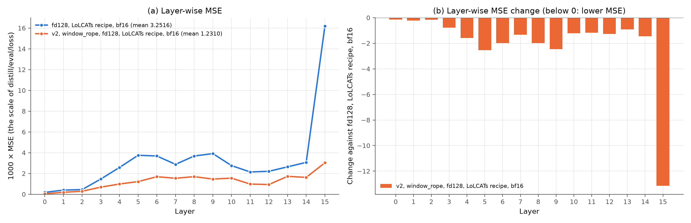
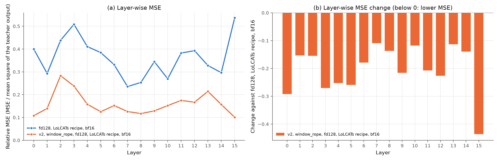
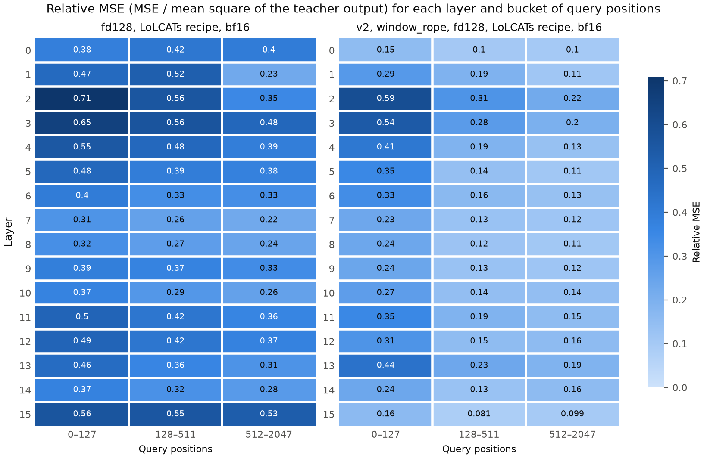
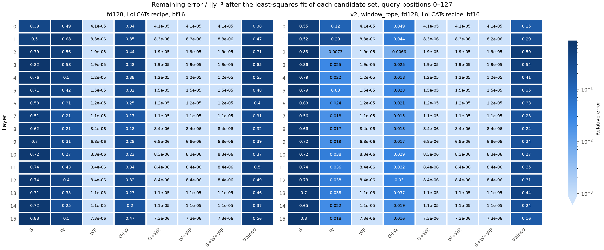
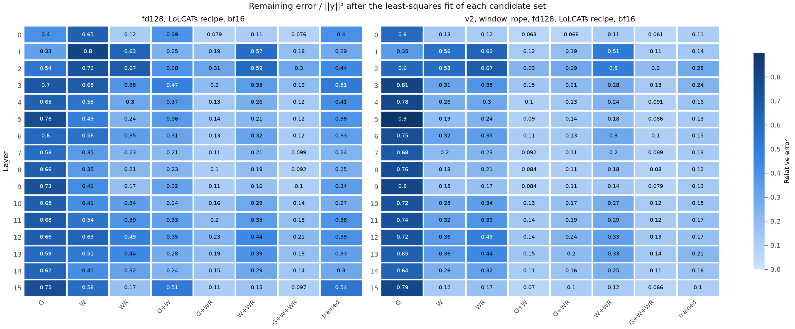

# Experiment: RoPE in the window branch (`window_rope`)

**Status:** Stage 1 and stage 2 finished on 2026-10-10. After stage 2: PIQA 73.1 and ARC-Easy 63.8, against 68.0 and 54.8 for Run 2 of Lizard Run 1. MMLU subset 25.6 ("Results", Run 2). After stage 1: validation loss 1.2290 (Run 1: 3.2549). PIQA 61.5 (Run 1: 57.6), ARC-Easy 43.3 (Run 1: 39.0), MMLU subset 24.6 (Run 1: 22.5). All six predictions hold. At positions 0–127, the window branch now gives almost the teacher output. There, most of the error comes from the mix of the two branches. The gated branch keeps the weight 1, but its best weight there is 0.08 ("Results", findings 6 and 7).

## Question

Does RoPE in the window branch give a better stage 1, and a higher PIQA and ARC-Easy accuracy, than Lizard Run 1? This is step 2 of [document 20](../20-layer-mse-for-piqa-arc.md), section 5, and step B5 of [document 19](../19-next-steps-from-literature.md).

## Why this change

| Evidence | Source |
|---|---|
| Inside the window, the window branch without RoPE explains only approximately 60% of the teacher output, even with the best weight for each head. A window with RoPE explains all of it. | [XAI: branch decomposition](xai-branch-fit.md), findings 1 and 2 |
| A window with RoPE halves the error of the current branches, and cuts it 4.4–6.9 times in layers 0 and 15 | [XAI: branch decomposition](xai-branch-fit.md), finding 5 |
| Heads 14 and 23 of layer 15 give approximately 21% of the stage 1 loss. With a window with RoPE, their error is 0.017 and 0.134. | [XAI: branch decomposition](xai-branch-fit.md), finding 6 |
| The window of LoLCATs has RoPE. On short prompts, it computes the teacher attention, and PIQA is 73.5 against 57.6. | [LoLCATs control](lolcats-control.md), finding 2 |
| A window without RoPE cannot give the previous-token attention of layer 0 | [Document 15](../15-attention-math-side-by-side.md), claim F |
| The Liger paper writes its window without RoPE, but the Liger code applies RoPE | [Document 15](../15-attention-math-side-by-side.md), table |

The Lizard paper writes the window without RoPE. Thus the thesis must report this run as an extension, not as the reproduction ([document 19](../19-next-steps-from-literature.md), part B).

## What changes, and what stays the same

| Setting | Lizard Run 1 | This experiment |
|---|---|---|
| Model config | `distill_llama3_2_1b_lizard_w128_fd128_m4` | [`distill_llama3_2_1b_lizard_v2_w128_fd128_m4_windowrope`](../../configs/model/distill_llama3_2_1b_lizard_v2_w128_fd128_m4_windowrope.yaml) |
| Attention code | v1 (`lizard_attention.py`) | v2 (`lizard_attention_v2.py`). With the default options, v2 gives the outputs of v1 (`test_defaults_match_v1_exactly`). |
| **RoPE in the window branch** | **No** | **Yes (`window_rope: true`)** |
| Gated branch | No RoPE | No RoPE (no change) |
| Feature dimension, window, sinks | 128, 128, 4 | The same |
| α, normalization, feature maps, gate | One α for each layer, `row`, one map and one gate for each layer | The same |
| Precision | bf16 | The same |
| Stage 1 recipe and data | `distill_alpaca_clean_xent0_mse1000_lr1e-2_1b` (LoLCATs recipe), Alpaca | The same |
| Stage 2 | Run 2 | Not in this experiment |

The window branch applies RoPE to its queries and keys with the cos and sin of the teacher (`window_inputs` in `lizard_attention_v2.py`). When the model generates text, the cache holds the keys after RoPE ([document 13](../13-lizard-attention-v2.md), P5).

## Predictions

[XAI: branch decomposition](xai-branch-fit.md) gives reference values for Run 1. The table converts the relative errors of each layer into a stage 1 loss. The conversion uses the mean square of the teacher output of each layer ([`fd128_lolcats.json`](xai-layer-wise-mse/fd128_lolcats.json)). The conversion of the trained output gives 3.252, against the stored loss 3.2549.

| Fit of the Run 1 branches (positions 0–2047) | Estimated stage 1 loss |
|---|---|
| The trained output of Run 1 | 3.25 |
| G+W: the best weights of the two trained branches | 2.96 |
| WR: a window with RoPE alone, without the gated branch | 2.43 |
| G+WR: the trained gated branch and a window with RoPE, with the best weights | 1.20 |

1. **Stage 1 loss:** clearly below 3.25, and probably below 2.96. A loss below 2.43 means that the trained gated branch adds to a window with RoPE.
2. **Not down to 1.20:** with `gla_norm: row`, the gated branch keeps the weight 1. But its best weight in Run 1 was 0.71–0.92 ([XAI: branch decomposition](xai-branch-fit.md), finding 7). Thus the loss probably stays above 1.20.
3. **Short positions:** the relative MSE of positions 0–127 decreases clearly from 0.463 (Run 1, [XAI: MSE by token position](xai-position-mse.md)). It probably stays above 0, for the reason of prediction 2.
4. **Layers:** layers 0 and 15, and heads 14 and 23 of layer 15, improve most.
5. **α of layer 0:** above 0.042 (Run 1). A window with RoPE can give the local attention of layer 0, as the window of LoLCATs does ([LoLCATs control](lolcats-control.md), finding 8).
6. **Accuracy:** PIQA and ARC-Easy increase. A gain needs at least 3.2 points over the PIQA of Run 1 (57.6), which is approximately 2 unpaired SE. The ARC-Easy of Run 1 stage 1 is not measured yet. The evaluation below measures it.

## How to run

### 1. A new Docker image

The job runs the code inside the image, and the image does not have the new config yet ([document 3](../03-infrastructure.md)). After the merge, select Actions → "Docker image" → Run workflow on GitHub.

### 2. Stage 1 on HF Jobs (H200)

```bash
make hf-job IMAGE=mahdikhashan/lolcats HF_REPO=nanoman1/lolcats-lizard-llama-3.2-1b HF_FLAVOR=h200 HF_TIMEOUT=2h \
  ARGS="--model_config distill_llama3_2_1b_lizard_v2_w128_fd128_m4_windowrope --no_finetune"
```

- **Recipe:** the job runs `make lizard`. Its default distill config is the LoLCATs recipe of Run 1. `--model_config` replaces the model config of the target.
- **Time and cost:** approximately 1 hour and $5. This is an estimate: stage 1 of Run 1 (bf16) took approximately 50 minutes ([document 2](../02-compute-and-cost.md)).
- **First check during the run:** `hf jobs logs <job id> | grep -a "Eval step"`. The loss must decrease. Run 1 ended at 3.2549.
- **Checkpoint on the Hub:**

```text
checkpoints/distill_llama3_2_1b_lizard_v2_w128_fd128_m4_windowrope/dl-d=distill_alpaca_clean_xent0_mse1000_lr1e-2_1b-m=distill_llama3_2_1b_lizard_v2_w128_fd128_m4_windowrope-f=finetune_lora_qkvo_alpaca_clean_1b-s=0-se=0-re=0_distill.pt
```

### 3. Evaluation and XAI on `student06` (A10)

Set the GPU variables in the shell that runs the commands, for example inside the `tmux` session. The check must print one A10.

```bash
cd /system/user/khashan/lolcats && git pull && conda activate lolcats-env
export CUDA_DEVICE_ORDER=PCI_BUS_ID CUDA_VISIBLE_DEVICES=0
python -c "import torch; print(torch.cuda.device_count(), torch.cuda.get_device_name(0))"  # 1 NVIDIA A10
MC=distill_llama3_2_1b_lizard_v2_w128_fd128_m4_windowrope
DC=distill_alpaca_clean_xent0_mse1000_lr1e-2_1b
CACHE=$HOME/.cache/huggingface/hub
OUT=results/window_rope && mkdir -p $OUT

# 1. Benchmarks of this model, and ARC-Easy of Run 1 stage 1 (the missing reference)
MODELS=stage1 TASKS="mmlu_subset piqa arc_easy" MODEL_CONFIG=$MC OUT_DIR=$OUT/stages-window-rope scripts/compare_stages.sh
MODELS=stage1 TASKS=arc_easy OUT_DIR=$OUT/stages-run1-arc scripts/compare_stages.sh

# 2. XAI: layer-wise MSE, MSE by token position, branch decomposition
python scripts/layer_mse.py compute $OUT/layer_mse.json --model_config $MC --distill_config $DC \
  --label "v2, window_rope, fd128, LoLCATs recipe, bf16" --cache_dir $CACHE
python scripts/position_mse.py compute $OUT/position_mse.json --from_json $OUT/layer_mse.json --cache_dir $CACHE
python scripts/branch_fit.py compute $OUT/branch_fit.json --from_json $OUT/layer_mse.json --cache_dir $CACHE

# 3. Plots against Run 1 stage 1
R1=docs/experiments
python scripts/layer_mse.py plot $OUT/layer_mse_vs_run1 $R1/xai-layer-wise-mse/fd128_lolcats.json $OUT/layer_mse.json
python scripts/layer_mse.py plot $OUT/layer_mse_vs_run1_relative $R1/xai-layer-wise-mse/fd128_lolcats.json $OUT/layer_mse.json --relative
python scripts/position_mse.py heatmap $OUT/position_heatmap $R1/xai-position-mse/fd128_lolcats.json $OUT/position_mse.json
for bucket in 0-127 all; do
  python scripts/branch_fit.py plot $OUT/branch_fit_$bucket $R1/xai-branch-fit/fd128_lolcats.json $OUT/branch_fit.json --bucket $bucket
done

zip -r window-rope-$(date +%Y%m%d-%H%M).zip $OUT
```

- `compare_stages.sh` finds the checkpoint from `MODEL_CONFIG` and the default recipe. It downloads a missing checkpoint from `HF_REPO`.
- In the branch decomposition of this model, W is the window branch with RoPE and the sinks. Thus W at positions 0–127 must be close to WR.

## Tests

CPU, 2026-10-09.

| Check | Result |
|---|---|
| The config against Run 1 | The model section is equal. In the attention section, only `attention_type` (v2) and `window_rope` differ. The v2 options have the same keys as the C1 config. |
| `pytest tests/test_lizard_attention_v2.py` | 60 passed. They include `window_rope` against the loop reference and the decode form, and the v2 defaults against v1. |
| A tiny copy of the config at initialization (3 layers, window 16, `branch_fit.py --checkpoint init`) | At positions 0–15, W has an error of 0.089 with `window_rope`, and 0.414 without. At positions 16–31, W gives 0.371 and WR 0.373. Thus the window branch uses RoPE. The rest of 0.089 comes from the 4 sinks at their start value. |
| Training of the tiny copy: the real stage 1 recipe, sequences of 1024 tokens, 8 steps | The validation loss decreased at each evaluation: 8536, 8148, 7805. The checkpoint has 15 Lizard tensors (3 layers × 5). It loads with 0 missing and 0 unexpected keys, and `layer_mse.py` reproduces its stored loss. After the training, W at positions 0–15 has an error of 0.094. |

**Two notes from the tests:**

- After the training, `distill_llama.py` stopped with an error in the sample generation. The tiny word-level tokenizer gives `token_type_ids`, and `generate` does not accept them. The earlier CPU tests had the same error. The tokenizer of Llama does not give them.
- The trainer evaluates one batch more than `--max_eval_batches` (`default_lm.py`). Thus the stored loss of the test needed 3 batches in `layer_mse.py`. Real runs evaluate all batches, so this has no effect on them.

## Results

### Run 1: stage 1 and evaluation (2026-10-10)

- **Training:** HF Jobs with `HF_FLAVOR=a100-large` and `HF_TIMEOUT=6h`. The job trained at 1.24 sequences each second for 2 epochs.
- **Evaluation:** `student06`, one A10, lolcats `02b4ce9`. The commands are the block of "How to run", section 3. The XAI scripts used all 16 validation batches (32,768 tokens).
- **Checks:**
  1. In each evaluation, all 80 expected Lizard tensors loaded. 0 missing, 0 unexpected.
  2. `layer_mse.py` gives the loss 1.2310, against the stored loss 1.2290 (+0.16%). The earlier bf16 checkpoints gave −0.11% to −0.22%.
  3. The position buckets add up to the MSE over all positions, with a relative difference of 3.6e-8.
  4. The branches reproduce the checkpoint output with a relative error of 1.7e-3. This is the bf16 rounding, as for the bf16 checkpoints of X2.
- **Files in [`window-rope/`](window-rope/):** the summaries of the two evaluations ([this model](window-rope/stages_window_rope.md), [ARC-Easy of Run 1](window-rope/stages_run1_arc.md)) and their lm-eval CSV files. The folder also has the plots with their tables. The JSON files are `v2_window_rope.json` in the folders of the three XAI documents.

#### Validation loss during stage 1

| Step | 100 | 200 | 300 | 400 | 500 | 600 | 1000 | 1100 |
|---|---|---|---|---|---|---|---|---|
| Loss | 2.0879 | 1.7700 | 1.6123 | 1.5103 | 1.4014 | 1.3315 | 1.2480 | **1.2290** |

The values come from the job log. This document does not have the values of steps 700–900. The first epoch ends near step 589. Before that step, the loss decreased by 0.07–0.32 for each 100 steps. In the second epoch, it decreased by approximately 0.02 for each 100 steps. The checkpoint holds step 1100, the last evaluation.

#### Scores

z values with unpaired SEs. The ARC-Easy of Run 1 comes from this evaluation. The other values of Run 1 come from [stage difference](stage-difference.md), and the values of LoLCATs from [LoLCATs control](lolcats-control.md).

| Measure | Lizard Run 1, stage 1 | `window_rope`, stage 1 | Difference | LoLCATs attention, stage 1 |
|---|---|---|---|---|
| Stage 1 validation loss | 3.2549 | **1.2290** | −62% | 0.4442 |
| PIQA | 57.6 ± 1.2 | **61.5 ± 1.1** | +3.9 points, z ≈ 2.4 | 73.5 |
| PIQA, normalized | 55.5 ± 1.2 | 58.8 ± 1.1 | +3.3 points, z ≈ 2.0 | – |
| ARC-Easy | 39.0 ± 1.0 | **43.3 ± 1.0** | +4.3 points, z ≈ 3.0 | 62.8 |
| ARC-Easy, normalized | 37.8 ± 1.0 | 41.0 ± 1.0 | +3.2 points, z ≈ 2.3 | 58.0 |
| MMLU subset | 22.5 ± 2.5 | 24.6 ± 2.5 | +2.1 points, z ≈ 0.6 | 26.0 |
| "A" / "B" / "C" / "D" on MMLU | 95.4% / 2.8% / 1.8% / 0.0% | 40.0% / 20.4% / 16.5% / 23.2% | – | 19.3% / 14.7% / 42.8% / 23.2% |
| Letter mass, confidence, entropy | 0.018, 0.586, 1.550 bits | 0.498, 0.743, 0.963 bits | – | 0.962, 0.450, 1.746 bits |

#### Lizard parameters

From the gate tables of the two evaluation summaries. The tables use one 5-shot MMLU prompt of 2048 tokens.

| Measure | Lizard Run 1 | `window_rope` |
|---|---|---|
| α, layers 0–15 | 0.042–0.648 | 0.293–0.719 |
| α, layer 0 | 0.042 | 0.660 |
| Sink logit, layer 0 | 0.73 | 4.25 |
| Gate, layers 1–15: tokens with γ > 0.999 | 100.0% | 99.9–100.0% |
| Gate, layer 0: weight kept after 128 tokens | 0.35 | 0.87 |

#### Plots











#### Means over the layers

Relative MSE: the MSE divided by the mean square of the teacher output. Branch fits: the remaining error divided by ‖y‖², with the best weights for each head ([XAI: branch decomposition](xai-branch-fit.md)). "Best weight of G" is the median over the layers of the median weight of the heads, in the G+W fit.

| Measure | Lizard Run 1 | `window_rope` | LoLCATs attention |
|---|---|---|---|
| Relative MSE, positions 0–127 | 0.463 | 0.321 | 0.0000151 |
| Relative MSE, positions 128–511 | 0.407 | 0.168 | 0.035 |
| Relative MSE, positions 512–2047 | 0.341 | 0.141 | 0.067 |
| W alone, positions 0–127 | 0.403 | 0.048 | – |
| G+W, positions 0–127 | 0.314 | 0.025 | – |
| Trained output, positions 0–127 | 0.463 | 0.321 | – |
| G+W, all positions | 0.328 | 0.116 | – |
| Trained output, all positions | 0.363 | 0.159 | – |
| Best weight of G: 0–127 / 128–511 / 512–2047 / all | 0.42 / 0.76 / 0.84 / 0.81 | 0.08 / 0.65 / 0.79 / 0.75 | – |

#### Findings

**Finding 1: RoPE in the window is a real gain on PIQA and ARC-Easy**. PIQA increases by 3.9 points (z ≈ 2.4), and ARC-Easy by 4.3 points (z ≈ 3.0). Both pass the rule of 2 SE. These are the highest PIQA and ARC-Easy scores of all Lizard stage 1 checkpoints. The earlier checkpoints have PIQA 55.8–57.7 and ARC-Easy 29.9–39.0 ([XAI: MSE by token position](xai-position-mse.md), accuracy table).

**Finding 2: the loss closes most of the gap to LoLCATs, but the accuracy closes only a small part**. Between Run 1 and LoLCATs, the stage 1 loss closes 72% of the gap. PIQA closes 25% of its gap, and ARC-Easy 18%.

**Finding 3: the "A" collapse on MMLU is mostly gone, but the accuracy stays at chance**. The share of "A" falls from 95.4% to 40.0%, and the letter mass increases from 0.018 to 0.498. The accuracy is 24.6%. An answer of "A" for every question gives 24.2%.

**Finding 4: the MSE decreases in every layer, most of all in layers 15 and 0**. 1000 × MSE is 1.5–5.3× lower than in Run 1. The largest factors are in layer 15 (from 16.19 to 3.03, 5.3×) and layer 0 (3.7×). Heads 14 and 23 of layer 15 have 13.7× and 11.3× less MSE. In Run 1, they gave 21% of the loss. Now they give 4.4%. Against LoLCATs, the MSE is still 1.7× (layer 5) to 10× (layer 0) higher.

**Finding 5: the window branch now gives almost the teacher output at short positions**. At positions 0–127, W alone keeps a mean error of 0.048 with the best weight for each head (Run 1: 0.403). Layers 2–15 have 0.007–0.038, and layers 0 and 1 have 0.117 and 0.293. The oracle WR gives 1.3e-5. W and WR use the same queries and keys, and only W has the 4 sinks. Thus the sinks cause the remaining error of W. In layer 0, the sink logit increased from 0.73 to 4.25.

**Finding 6: at short positions, the mix of the branches gives most of the error**. At positions 0–127, the trained output has a mean error of 0.321. The best weights of the same two branches give 0.025. Thus the trained mix has 13× the error of the best mix, and 3–89× in the single layers. In Run 1, this factor was 1.1–1.9. At these positions, the median best weight of G is 0.08 (0.03–0.47 in the layers). But with `gla_norm: row`, G keeps the weight 1. The best weight of W is 0.98–1.6, but α is 0.29–0.72.

**Finding 7: the best weight of G depends on the position**. Its median is 0.08 at positions 0–127, 0.65 at positions 128–511 and 0.79 at positions 512–2047. One α for each layer and the constant weight 1 of G cannot fit all three cases. In the stage 1 loss, 94% of the positions are above 127. Thus the training sets the mix for long contexts. PIQA and ARC-Easy prompts are short, so they get a mix that does not fit them. This probably explains finding 2.

**Finding 8: short positions now have the largest error**. At positions 0–127, the relative MSE decreases by 31% (from 0.463 to 0.321). At the other two buckets, it decreases by 59%. Thus the error at positions 0–127 is now 1.9× and 2.3× the error of the other two buckets. Layers 2 and 3 have the largest error there (0.593 and 0.538), only 16–18% less than in Run 1. In these two layers, the trained mix has 89× and 22× the error of the best mix.

**Finding 9: over all positions, the best mix would lower the loss by approximately 28%**. With the best weights of G and W, the estimated stage 1 loss is 0.89, against 1.23. The conversion is the conversion of "Predictions". The trained output of this model gives 1.231 with the same conversion.

#### Check of the predictions

| Prediction | Result | Holds |
|---|---|---|
| 1. Stage 1 loss clearly below 3.25, probably below 2.96 | 1.2290. It is also below 2.43, so the trained gated branch adds to the window with RoPE. | Yes |
| 2. Not down to 1.20, because the gated branch keeps the weight 1 | 1.2290, 2% above 1.20. The best weight of G is below 1 (finding 7). | Yes |
| 3. The relative MSE of positions 0–127 decreases clearly from 0.463, but stays above 0 | 0.321 (−31%), the smallest decrease of the three buckets (finding 8) | Yes |
| 4. Layers 0 and 15, and heads 14 and 23 of layer 15, improve most | Layer 15: 5.3×, layer 0: 3.7×, the two largest factors. Heads 14 and 23: 13.7× and 11.3× (finding 4). | Yes |
| 5. α of layer 0 above 0.042 | 0.660 | Yes |
| 6. PIQA and ARC-Easy increase, PIQA by at least 3.2 points | PIQA +3.9, ARC-Easy +4.3 (finding 1) | Yes |

#### Decision

- **Rule 1 applies.** PIQA and ARC-Easy increase by more than 2 SE. Thus RoPE in the window is a real gain.
- **Next: `window_rope` with `gla_norm: hybrid`** ([experiment](window-rope-hybrid.md)), as the rule says. Findings 6 and 7 support this run. With the shared denominator, the share of G can change with the position. The sum of the gated weights grows with all keys, but the window sum stops at 128 keys. It is not known whether the training sets a small share of G at short positions. In R1b, `hybrid` turned the window almost off (α 0.01–0.07, from the start value 0.1).
- **If the error at positions 0–127 stays high:** step 3 of [document 20](../20-layer-mse-for-piqa-arc.md), section 5. The gated branch then gets only the keys outside the window. With `hybrid`, a prompt shorter than the window then gets only the window and the sinks.
- **Stage 2** waits for the better of these configs.
- **Thesis:** report this run as an extension, not as the reproduction.

### Run 2: stage 2 (2026-10-10)

- **Training:** `make hf-job-finetune`, from the stage 1 checkpoint of Run 1. This is the first run of this target with a v2 config ([`window_rope` with the shared denominator](window-rope-hybrid.md), "Decision").
- **What stage 2 trains:** only the LoRA weights of q, k, v and o (128 tensors, 1,703,936 parameters). The Lizard parameters keep their stage 1 values. α and the sink logits are equal in the two evaluation summaries. The gates differ a little, because LoRA changes the hidden states.
- **Evaluation:** `student06`, one A10, lolcats `84228c5`, `MODELS=stage2`.
- **Checks:** in each evaluation, all 80 stage 1 tensors and all 128 stage 2 tensors loaded. 0 missing, 0 unexpected. The stored step of the stage 2 checkpoint (1100) is the best step.
- **Files in [`window-rope/`](window-rope/):** the [evaluation summary](window-rope/stages_stage2.md), its lm-eval CSV file, and the validation losses of stage 2 (`stage2_training.csv`).

#### Validation loss during stage 2

The causal language-model loss on the Alpaca validation data.

| Step | 100 | 200 | 300 | 400 | 500 | 600 | 700 | 800 | 900 | 1000 | 1100 |
|---|---|---|---|---|---|---|---|---|---|---|---|
| `window_rope` | 1.3432 | 1.2961 | 1.2792 | 1.2661 | 1.2575 | 1.2533 | 1.2482 | 1.2433 | 1.2413 | 1.2372 | **1.2352** |

Stage 2 of Lizard Run 1 (Run 2) started at 3.516 and ended at 2.252 ([stage difference](stage-difference.md)). Thus the final perplexity, exp(loss), is approximately 3.44 here, against approximately 9.5 for Run 2.

#### Scores

All values come from the same harness. z values with unpaired SEs. Run 2 is the model of [document 7](../07-results.md): the stage 1 checkpoint of Lizard Run 1 and the stage 2 checkpoint of Run 2.

| Measure | Run 2, after stage 2 | `window_rope`, stage 1 | `window_rope`, after stage 2 | Difference to Run 2 | LoLCATs attention, stage 1 |
|---|---|---|---|---|---|
| PIQA | 67.95 ± 1.09 | 61.5 ± 1.1 | **73.1 ± 1.0** | +5.1 points, z ≈ 3.4 | 73.5 |
| PIQA, normalized | 66.6 | 58.8 | 72.5 | +5.9 points | – |
| ARC-Easy | 54.8 ± 1.0 | 43.3 ± 1.0 | **63.8 ± 1.0** | +9.0 points, z ≈ 6.3 | 62.8 |
| ARC-Easy, normalized | 50.1 | 41.0 | 56.9 | +6.9 points | 58.0 |
| MMLU subset | 24.9 ± 2.6 | 24.6 ± 2.5 | 25.6 ± 2.6 | +0.7 points | 26.0 |
| "A" / "B" / "C" / "D" on MMLU | 98.6% / 1.1% / 0.4% / 0.0% | 40.0% / 20.4% / 16.5% / 23.2% | 41.4% / 37.5% / 20.7% / 0.4% | – | 19.3% / 14.7% / 42.8% / 23.2% |
| Letter mass, confidence, entropy | – | 0.498, 0.743, 0.963 bits | 0.980, 0.348, 1.908 bits | – | 0.962, 0.450, 1.746 bits |

The teacher gets 33.7 on the MMLU subset in this harness ([document 7](../07-results.md)). Its PIQA and ARC-Easy in this harness are not measured yet.

Values of the papers, from another version of the harness ([document 7](../07-results.md), Table 9 of the Lizard paper):

| Task | Lizard 1B | LoLCATs 1B | Teacher 1B |
|---|---|---|---|
| PIQA | 74.8 | 74.6 | 74.1 |
| ARC-Easy | 65.6 | 63.0 | 65.4 |

#### Findings of Run 2

**Finding 10: after stage 2, `window_rope` is the best Lizard model of this project**. PIQA is 73.1 and ARC-Easy is 63.8. Against Run 2, PIQA increases by 5.1 points (z ≈ 3.4), and ARC-Easy by 9.0 points (z ≈ 6.3).

**Finding 11: the gain of stage 1 stays after stage 2, and it increases**. After stage 1, `window_rope` had +3.9 points on PIQA and +4.3 points on ARC-Easy against Lizard Run 1 (finding 1). After stage 2, the differences are +5.1 and +9.0. Stage 2 adds 11.6 points on PIQA and 20.5 points on ARC-Easy. For Lizard Run 1, stage 2 added 10.4 and 15.8 points.

**Finding 12: PIQA and ARC-Easy come near the values of the papers, but these values come from another harness**. PIQA is 1.7 points below Lizard 1B of the paper (74.8), and ARC-Easy is 1.8 points below (65.6). ARC-Easy is above LoLCATs 1B of the paper (63.0). The paper used a newer version of the harness. Thus only the teacher in this harness can give the real gap. In this harness, the LoLCATs attention after stage 1 has 73.5 and 62.8.

**Finding 13: the stage 2 loss is much lower than in Run 2**. The final validation loss is 1.235, against 2.252 for Run 2. The loss still decreased at the last evaluation (by 0.002 after step 1000).

**Finding 14: MMLU stays at chance**. The accuracy is 25.6%, and the teacher has 33.7%. The "A" collapse of Run 2 (98.6% "A") is gone, and the four letters get 98.0% of the probability. But the probability is spread almost evenly over "A", "B" and "C" (confidence 0.348, entropy 1.908 bits), and "D" gets 0.4% of the answers. Thus the model gives the answer format, but it does not find the right answer. The 5-shot MMLU prompts are long (up to 2048 tokens). Thus MMLU probably depends more on the part of the attention outside the window than PIQA and ARC-Easy do. This is a hypothesis.

#### Decision of Run 2

- **Report:** `window_rope` after stage 2 is the best Lizard model of this project. It is an extension, not the reproduction ([document 19](../19-next-steps-from-literature.md), part B).
- **Next, in minutes on the A10:** the teacher on PIQA and ARC-Easy in this harness (X0 of [gap analysis 2](../12-gap-analysis-2.md)). The command is `MODELS=teacher TASKS="piqa arc_easy" scripts/compare_stages.sh`. It gives the real gap to the teacher.
- **The remaining gap is MMLU** (25.6 against 33.7 for the teacher). Changes to the part outside the window, such as the gated branch and step 3 of [document 20](../20-layer-mse-for-piqa-arc.md), target this gap. Their effect must be checked on MMLU, not only on PIQA and ARC-Easy.

## Decision rules

- **PIQA or ARC-Easy increases by 2 SE or more:** RoPE in the window is a real gain. Next: `window_rope` with `gla_norm: hybrid`, which corrects the weight of the gated branch ([XAI: branch decomposition](xai-branch-fit.md), finding 7). Then stage 2 for the better config.
- **The loss decreases, but the accuracy does not:** the MSE does not predict the accuracy ([XAI: MSE by token position](xai-position-mse.md), finding 6). Check the MSE of positions 0–127 and the share of "A" in the MMLU subset. Then try `window_rope` with `gla_norm: hybrid`, because the gated branch keeps the weight 1 on short prompts (prediction 2).
- **The loss stays above 2.96:** check in the branch decomposition that W at positions 0–127 is close to WR. If it is close, the training of the other parts limits the result.
