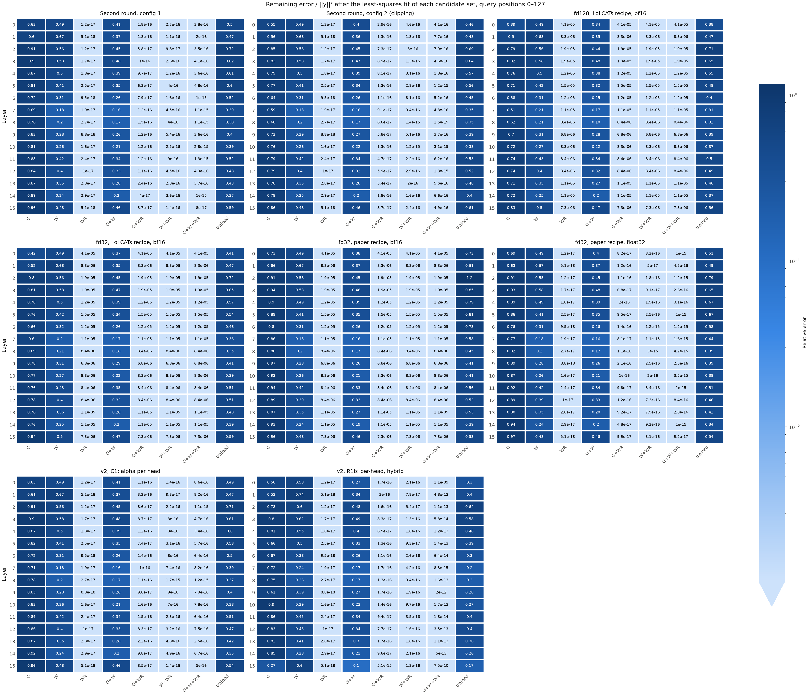
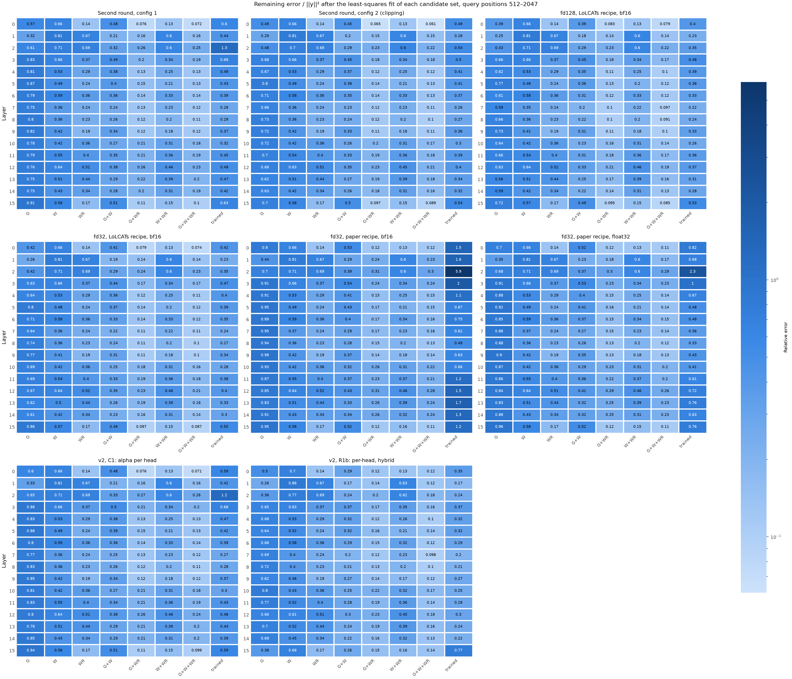
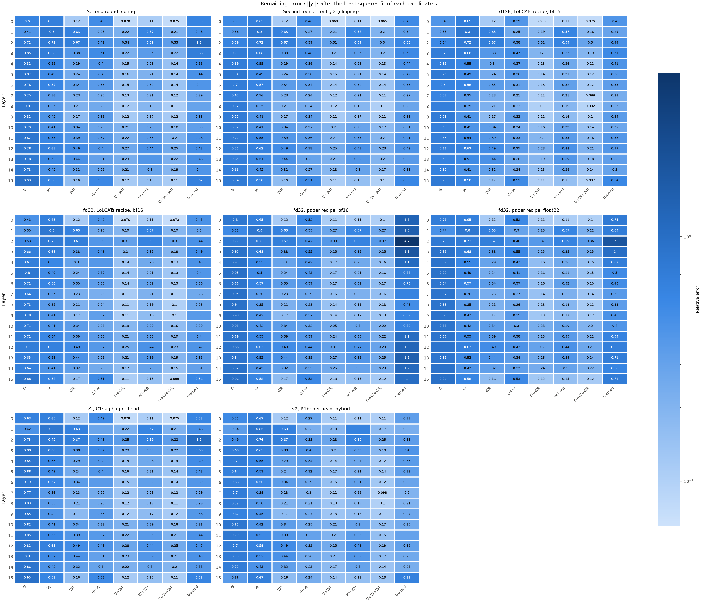

# Experiment (XAI): branch decomposition

**Status:** Run 1 finished on 2026-10-09: the 8 Lizard stage 1 checkpoints. Inside the window, the window branch without RoPE explains only approximately 60% of the teacher output. A window with RoPE would halve the error of the current branches, and 4–7 times in layers 0 and 15. The gated branch carries the long-range part, but with too much weight. This supports `window_rope` as the next change.

## Question

This is X2 of [document 20](../20-layer-mse-for-piqa-arc.md). Which branch of the Lizard attention limits the fit to the teacher: the window branch without RoPE, or the gated branch? How much of the error at short positions comes from the missing RoPE?

[XAI: MSE by token position](xai-position-mse.md) found that Lizard misses 35–63% of the teacher output at positions 0–127, where all keys are inside the window. X2 asks which part of the attention causes this.

## What the script calculates

`compute` uses the model, the data and the checkpoint of `scripts/layer_mse.py`. Each layer gets the teacher input. For each layer and head, the script calculates these outputs from the same q, k and v, before `o_proj`:

| Name | Output | Source |
|---|---|---|
| y | The teacher: softmax attention with RoPE over all previous keys. This is the stage 1 target. | Teacher |
| G | The gated branch: Hedgehog maps, gate and normalization | Checkpoint |
| W | The window branch, without the factor α. In v1, it has no RoPE and has the sinks. | Checkpoint |
| WR | Softmax attention with RoPE over the same window of keys, without sinks | Oracle, no trained parameters |
| trained | The output of the checkpoint. In v1, it is G + α W. | Checkpoint |

**The fit.** For each set of candidates and each head, the script finds the weights c with the lowest error ‖y − Σ c_s y_s‖². The sum is over the candidates in the set. The error is over the positions of one bucket. The script reports the remaining error divided by ‖y‖².

- **Sets:** G, W, WR, G+W, G+WR, W+WR and G+W+WR.
- **Meaning:** each branch gets one free weight for each head and bucket. Thus no scale of these branches, such as α, gives a lower error.
- **Buckets:** `--edges 0,128,512,2048` (the default) gives the query positions 0–127, 128–511 and 512–2047. The script also fits all positions together.
- **The error of a layer:** the sum of the remaining errors of its heads, divided by the sum of ‖y‖² of its heads. Each head has its own weights.
- **Output:** for each layer and bucket, the error of the layer, the error of each head and the weights of each head. The summary gives the mean over the layers.
- **v2 checkpoints:** the script uses the branch weights of the layer (`branch_weights`). W is the window part divided by α of its head.
- **LoLCATs:** not supported. Its two parts share one denominator, so they are not separate branches of this kind.

**Checks:**

1. G + α W (or the v2 branch weights times v) reproduces the output of the checkpoint.
2. A query before position 128 sees all its keys inside the window. There, WR is the teacher attention, so its error is only rounding.
3. The trained output is one point of the G+W fit (with the weights 1 and α). Thus its error is never below the error of the G+W fit.

`plot` draws one heatmap for each result: the layers in the rows, the candidate sets and `trained` in the columns. `--bucket` selects the positions. All panels use one color scale.

### What each comparison shows

| Comparison | Question |
|---|---|
| W against WR, positions 0–127 | How much error comes from the window branch itself: the missing RoPE and the sinks? |
| G+W against W, positions 0–127 | Does the gated branch help where all keys are inside the window? |
| G+WR against WR, positions 512–2047 | Does the gated branch give the part of the teacher output from keys outside the window? |
| trained against G+W | Does the training reach the best scale of the two branches? The difference is the mixing gap. |

## Predictions

1. **WR at positions 0–127:** only rounding. For bf16 checkpoints, this is approximately 1e-5, as for LoLCATs in [XAI: MSE by token position](xai-position-mse.md), finding 1.
2. **W against WR at positions 0–127:** W has a much larger error, most of all in layers 0–3. The window without RoPE cannot give the local attention of the teacher ([document 15](../15-attention-math-side-by-side.md), claim F). Layers 2 and 3 have the largest error at these positions (X1, finding 3).
3. **Mixing gap:** for the v1 checkpoints, the G+W fit has a clearly lower error than the trained output in some layers. One α for each layer, and the weight 1 of the gated branch, are fewer free weights than the fit has. For C1 (α for each head), the gap is smaller.

## Limits

- **The gated branch is the trained one.** The checkpoint trained G together with W, not with WR. A model with `window_rope` would train another G. Thus G+WR shows what the current G adds to an exact window, not the best possible result.
- **The fit has more freedom than the model.** It has one weight for each branch, head and bucket. Thus its error is a lower limit for these branches. The model itself can be worse.
- **WR is an oracle.** It has no sinks and uses the teacher scores. A trained window with RoPE and sinks can differ.
- **One data set.** The data loader packs the Alpaca validation data into sequences. A validation sequence usually starts inside a sample.

## How to run

On `student06`, in the `lolcats-env` environment, from the repository root. Set the GPU variables in the shell that runs the commands, for example inside the `tmux` session. The check must print one A10.

```bash
export CUDA_DEVICE_ORDER=PCI_BUS_ID CUDA_VISIBLE_DEVICES=0
python -c "import torch; print(torch.cuda.device_count(), torch.cuda.get_device_name(0))"  # 1 NVIDIA A10

mkdir -p results/branch_fit
for name in fd32_lolcats fd128_lolcats fd32_paper_bf16 fd32_paper_fp32 config1 config2 \
            v2_alphahead v2_perhead_hybrid; do
  python scripts/branch_fit.py compute results/branch_fit/$name.json \
    --from_json docs/experiments/xai-layer-wise-mse/$name.json --cache_dir ~/.cache/huggingface/hub \
    2>&1 | tee results/branch_fit/$name.log
done

for bucket in 0-127 512-2047 all; do
  python scripts/branch_fit.py plot results/branch_fit/branch_fit_$bucket results/branch_fit/*.json --bucket $bucket
done

zip -r branch-fit-$(date +%Y%m%d-%H%M).zip results/branch_fit
```

- **Checkpoints:** the 8 Lizard checkpoints of [XAI: layer-wise MSE](xai-layer-wise-mse.md). `--from_json` takes their configs, checkpoint paths and labels.
- **Time:** each `compute` runs the forward passes of `layer_mse.py` and some dense matrices for each layer. Thus a few minutes for each checkpoint (an estimate).
- **Check in the log:** the last lines give the mean errors and the largest error of check 1. For bf16 checkpoints, check 1 is of the order of 1e-3, because the checkpoint rounds its output to bf16.

## Tests

CPU, 2026-10-09, in a copy of the repository with tiny random Llama models (3 layers, 4 heads, window 16) and sequences of 64 tokens. The configs of the copy point to these models.

| Check | Result |
|---|---|
| Tiny v1 checkpoint, `--edges 0,16,32,64` | Check 1: 0 (float32). WR at positions 0–15: below 1e-15. The `trained` column equals the relative MSE of `position_mse.py` for each bucket (0.7908, 1.481 and 1.890). |
| numpy `lstsq` on the raw vectors of layer 1, for the sets WR, G+W and G+W+WR, buckets 16–31 and all | The largest relative difference to the JSON is 3.4e-6, from the 6 significant digits in the JSON. For each head, the error of `trained` is at least the error of the G+W fit. |
| Tiny v2 checkpoints: the C1 config (α for each head) and the R1b config (`hybrid`) | Check 1: 1.0e-7 and 8.6e-8. The JSON has α of each head. |
| LoLCATs checkpoint | The script stops with the message that it supports Lizard layers only. |
| `plot` | 3 results with the buckets 0–15 and all, and 8 synthetic results with 16 layers. An unknown bucket stops with a message. |

The values of the tiny models do not predict the values at 1B.

## Results

### Run 1: the 8 Lizard stage 1 checkpoints (2026-10-09)

- **Commands:** the loop of "How to run", then `plot` for the buckets 0–127, 512–2047 and all.
- **Machine and code:** `student06`, lolcats `e7a86dc`. Data: all 16 validation batches (32,768 tokens).
- **Checks:**
  1. All expected keys loaded, 0 missing, 0 unexpected.
  2. The branches reproduce the checkpoint output: 0 for float32 v1, 1.7e-3 for bf16 (the bf16 rounding of the output), and 7.0e-7 to 7.9e-7 for v2.
  3. WR at positions 0–127: the mean over the layers is 1.3e-5 (bf16) or 1.7e-17 (float32). The largest value of one head is 1.0e-4.
  4. In every layer, bucket and head, the error of `trained` is at least the error of the G+W fit.
- **Files in [`xai-branch-fit/`](xai-branch-fit/):** the 8 JSON files, and the heatmaps and tables for the buckets 0–127, 512–2047 and all.

#### Means over the layers

Remaining error / ‖y‖². WR is 0 at positions 0–127 in every checkpoint (check 3).

| Checkpoint | W, 0–127 | G+W, 0–127 | trained, 0–127 | WR, 512–2047 | G+WR, 512–2047 | G+W, all | G+WR, all | trained, all |
|---|---|---|---|---|---|---|---|---|
| fd32, LoLCATs recipe, bf16 | 0.404 | 0.318 | 0.488 | 0.352 | 0.151 | 0.339 | 0.166 | 0.379 |
| fd128, LoLCATs recipe, bf16 | 0.403 | 0.314 | 0.463 | 0.352 | 0.142 | 0.328 | 0.158 | 0.363 |
| fd32, paper recipe, bf16 | 0.394 | 0.316 | 0.629 | 0.352 | 0.206 | 0.402 | 0.214 | 1.262 |
| fd32, paper recipe, float32 | 0.394 | 0.318 | 0.514 | 0.352 | 0.190 | 0.388 | 0.201 | 0.674 |
| Second round, config 1 | 0.396 | 0.320 | 0.499 | 0.352 | 0.169 | 0.369 | 0.184 | 0.495 |
| Second round, config 2 (clipping) | 0.398 | 0.318 | 0.491 | 0.352 | 0.155 | 0.351 | 0.171 | 0.402 |
| v2, C1: alpha per head | 0.396 | 0.320 | 0.486 | 0.352 | 0.171 | 0.370 | 0.186 | 0.479 |
| v2, R1b: per-head, hybrid | 0.458 | 0.295 | 0.351 | 0.352 | 0.162 | 0.280 | 0.175 | 0.308 |

#### Heatmaps







#### Findings

**Finding 1: the oracle check passes**. At positions 0–127, WR gives 1.3e-5 (bf16) or 1.7e-17 (float32). Thus the window mask and the RoPE of WR are correct.

**Finding 2: the window without RoPE explains only approximately 60% of the teacher output inside the window**. At positions 0–127, W keeps an error of 0.394–0.458, even with the best weight for each head. With RoPE, the error is 0 (finding 1). Thus most of the error at short positions comes from the window branch itself: the missing RoPE and the sinks. For fd128, the largest values are in layers 1 (0.675), 3, 2, 4, 15 and 0 (0.491). The middle layers 7 and 8 have 0.209.

**Finding 3: inside the window, the gated branch helps only a little**. At positions 0–127, G+W has 0.78–0.81 × the error of W for the v1 checkpoints and C1, and 0.64 × for R1b.

**Finding 4: outside the window, the gated branch gives a large part of the output**. WR alone keeps an error of 0.352 at positions 512–2047, because it has no keys outside the window. G+WR has 0.40–0.58 × this error, and 0.52–0.64 × at positions 128–511. In layers 1 and 2, WR alone keeps 0.67–0.69 at positions 512–2047, and G+WR keeps 0.14–0.31. Thus the gated branch carries the long-range part, and it is not the main limit.

**Finding 5: a window with RoPE halves the error of the current branches**. Over all positions, G+WR has 1.9–2.1 × less error than G+W for the v1 checkpoints and C1, and 1.6 × less for R1b. In layers 0 and 15, the factor at positions 512–2047 is 4.4–6.9 in all checkpoints except R1b. For R1b, it is 2.4 and 1.8.

**Finding 6: heads 14 and 23 of layer 15 are window heads**. With WR alone, their error over all positions is 0.017 and 0.134–0.136. The trained output has 0.57–0.62 and 0.90–0.94 in the 7 checkpoints other than R1b. Thus the largest single source of the stage 1 loss ([XAI: layer-wise MSE](xai-layer-wise-mse.md), finding 5) is the window without RoPE. R1b reached 0.14 and 0.23 for these heads through its short gate ([document 13](../13-lizard-attention-v2.md), finding 3).

**Finding 7: the gated branch has too much weight**. In the G+W fit over all positions, the median weight of G is 0.55–0.81 for the v1 checkpoints and C1, not 1. The medians of the single layers are 0.36–0.92. For R1b, with the shared denominator of `hybrid`, it is 0.98. This agrees with claim C of [document 15](../15-attention-math-side-by-side.md): the total weight of a Lizard row is 1 + αρ, more than 1.

**Finding 8: the mixing gap depends on the recipe**. Over all positions, the trained output has more error than the G+W fit:

- **+10% to +14%:** the LoLCATs recipe (fd32, fd128), config 2 and R1b.
- **+29% to +34%:** config 1 and C1.
- **+74% and +214%:** the recipe of the paper, in float32 and bf16.

For the v1 checkpoints and C1, the best weight of W also shows how well α trained. The median difference between the best weight and α is:

- 0.016–0.018 for the LoLCATs recipe and config 2,
- 0.11–0.12 for config 1 and C1,
- 0.26 and 0.53 for the recipe of the paper (float32, bf16).

In the bf16 run of the recipe of the paper, α stayed at 1.0 ([paper LR](paper-lr.md)). But the best weights of the layers are 0.14–0.68 (medians over the heads).

#### Check of the predictions

| Prediction | Result | Holds |
|---|---|---|
| 1. WR at positions 0–127 is only rounding | 1.3e-5 (bf16), 1.7e-17 (float32) (finding 1) | Yes |
| 2. W has a much larger error than WR at positions 0–127, most of all in layers 0–3 | 0.394–0.458 against approximately 0. For fd128, the largest values are in layers 0–4 and 15 (finding 2). | Yes |
| 3. A clear mixing gap in some layers, smaller for C1 | Clear for most checkpoints. C1 has +29%, config 1 +34%, so only a little smaller (finding 8). | Partly |

#### Decision

- **Window (rule 1):** W keeps 0.39–0.46 at positions 0–127, and WR keeps approximately 0. Thus the missing RoPE (and the sinks) is the cause of the error at short positions. `window_rope` comes first, as step 2 of [document 20](../20-layer-mse-for-piqa-arc.md), section 5, says.
- **Gated branch (rule 2):** the gated branch lowers the error of WR by 36–60% at positions 128–2047. Thus it is not the main limit, and X3 can wait.
- **Mixing gap (rule 3):** the gated branch should have less weight (finding 7). `gla_norm: hybrid` corrects this weight (R1b: 0.98). Thus a second run can combine `window_rope` with `hybrid`, after a run with `window_rope` alone.
- **Expected effect of `window_rope`:** layers 0 and 15 probably improve most. Heads 14 and 23 of layer 15 probably improve much (findings 5 and 6). The gated branch then trains together with a window with RoPE, so the result can differ from G+WR. X1 found that a small decrease of the MSE does not predict the accuracy. Thus only PIQA and ARC-Easy can show the effect on the accuracy.

## Decision rules

From [document 20](../20-layer-mse-for-piqa-arc.md), section 4:

- **Window:** compare W and WR at positions 0–127. If the error of WR is much lower, the missing RoPE is the cause. Then `window_rope` comes first.
- **Gated branch:** add the gated branch to the window with RoPE. If the error at positions 128–511 and 512–2047 does not decrease, the gated branch or its maps are the limit. Then X3 decides between the maps and the gate.
- **Mixing gap:** the trained output can be far above the G+W fit in a layer. Then the scale of the branches limits that layer, not the branches. α for each head (C1) and `gla_norm: hybrid` (R1b) change this scale. Their results show if these options close the gap.
