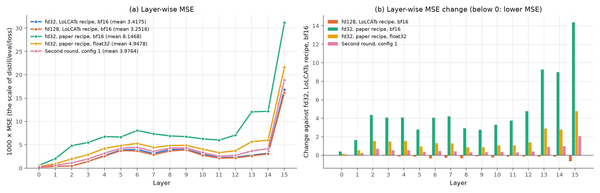
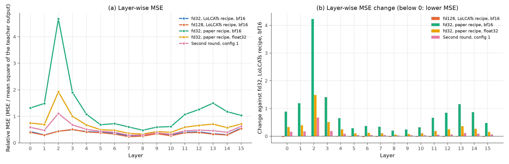

# Experiment (XAI): layer-wise MSE

**Status:** Run 1 finished on 2026-10-02: five stage 1 checkpoints, without retraining. The script reproduces the stored validation loss of each checkpoint. Two heads of layer 15 give approximately 20% of the stage 1 loss.

## Question

In which layers does the stage 1 Lizard attention differ most from the softmax attention of the teacher? Do the stage 1 recipes differ in all layers, or only in some layers?

The stage 1 validation loss (`distill/eval/loss`) is a mean over the 16 layers. It cannot show which layers cause the error. Figure 14 of the LoLCATs paper shows the error for each layer:

- **Figure 14a:** the MSE of each layer, for two attention types (Hedgehog linear attention, and LoLCATs linear + sliding window attention). Each type has one line after attention transfer and one line after LoRA. The model is Llama 3 8B.
- **Figure 14b:** the change of the MSE of each layer from LoRA.
- In that figure, the MSE is small in the first layers and largest in the last layers.

This experiment makes the same plot for the Lizard checkpoints of this project. It belongs to the XAI ideas ([XAI for the distillation](xai.md)), because it shows where in the model the approximation fails.

## Can we make the plot without retraining?

Yes. The layer-wise MSE needs only forward passes:

- **The teacher weights** (`meta-llama/Llama-3.2-1B`) and **the stage 1 checkpoint** (the Lizard weights of each layer).
- **The stage 1 validation data**: the first 200 examples of Alpaca-cleaned, in chunks of 2,048 tokens.
- In distillation mode (`train_attention`), each Lizard layer already calculates two outputs from the same q, k and v ([math formulas](../math-formula.md), section 3):
  - the teacher output: softmax attention with RoPE,
  - the Lizard output: the gated branch plus α × the window branch.
- The next layer gets the teacher output. Thus the error of one layer does not reach the next layer. Each value measures the approximation of one layer alone.

The stage 1 trainer calculates the same values. Then it keeps only 1000 × their mean. Thus the script must reproduce the stored validation loss of each checkpoint. This is a built-in check of the script.

**Stage 2** is also possible without retraining. After LoRA, q, k and v change. Then the teacher output comes from softmax attention with the adapted q, k and v. This document assumes that Figure 14 ("Attn. Transfer + LoRA") uses the same reference. The caption of the paper does not say this exactly. The script measures only stage 1 now.

## What the script calculates

`python scripts/layer_mse.py compute` writes one JSON file for each checkpoint. For each layer, it has:

| Value | Meaning |
|---|---|
| `mse` | MSE between the Lizard output and the teacher output, before `o_proj`. The stage 1 trainer calculates it in the same way (`nn.MSELoss`, mean over all elements). |
| `target_mean_square` | The mean square of the teacher output |
| `relative_mse` | `mse` / `target_mean_square`. The output scale differs between layers. The relative MSE removes this scale. |
| `mse_per_head` | The MSE of each of the 32 query heads |

All values are means over the validation batches. The file also has 1000 × the mean over the layers (`loss`) and the stored loss of the checkpoint. It also has the checkpoint check of `compare_stages.py` (SHA-256, step, missing keys).

`python scripts/layer_mse.py plot` reads several JSON files. It writes a PNG with two panels and a Markdown table with the same values:

- **(a)** the MSE of each layer, one line for each checkpoint. The y-axis shows 1000 × MSE. Thus the mean of each line is the validation loss of the checkpoint.
- **(b)** with 2 or more checkpoints: the change of each layer against the first checkpoint. A bar below 0 means a lower MSE than the first checkpoint. Figure 14b shows the absolute change. This plot keeps the sign.
- With `--relative`, both panels use the relative MSE.

## Predictions

1. **The check:** 1000 × the mean over the layers agrees with the stored loss of each checkpoint. An example is 3.9764 for config 1 of the [second round](second-round.md). Small differences can come from the GPU.
2. **The MSE differs between the layers**. As in Figure 14, the last layers probably have the largest MSE. This prediction is weak, because Figure 14 shows Llama 3 8B, not Llama 3.2 1B.
3. **The relative MSE can give a different order of the layers**, because the output scale differs between layers.
4. **The recipes differ most in the layers where their gates differ most**. The LoLCATs recipe gives the lowest validation loss (3.2549 with fd128, 3.4219 with fd32). Its gate saturates in 14 or 15 of the layers 1–15. With the recipe of the paper, the gate decays fast in layers 0–2 ([float32 experiment](float32.md), finding 3). Section 13.2 of the [gap analysis](../11-gap-analysis.md) gives the gate-state hypothesis. If it is right, panel (b) shows the largest differences in these layers.

## How to run

### Stage 1 checkpoints

| Label | Model config | Distill config | Stored loss |
|---|---|---|---|
| fd128, LoLCATs recipe, bf16 | `distill_llama3_2_1b_lizard_w128_fd128_m4` | `distill_alpaca_clean_xent0_mse1000_lr1e-2_1b` | 3.2549 |
| fd32, LoLCATs recipe, bf16 | `distill_llama3_2_1b_lizard_w128_fd32_m4` | `distill_alpaca_clean_xent0_mse1000_lr1e-2_1b` | 3.4219 |
| fd32, recipe of the paper, bf16 | `distill_llama3_2_1b_lizard_w128_fd32_m4` | `distill_alpaca_clean_xent0_mse1000_lr1e-3_cosine_1b` | 8.1641 |
| fd32, recipe of the paper, float32 | `distill_llama3_2_1b_lizard_w128_fd32_m4_fp32` | `distill_alpaca_clean_xent0_mse1000_lr1e-3_cosine_1b` | 4.9478 |
| Second round, config 1 | `distill_llama3_2_1b_lizard_w128_fd32_m4_fp32` | `distill_alpaca_clean_xent0_mse1000_lr1e-3_paper_noclip_1b` | 3.9764 |
| Gradient clipping, config 2 | `distill_llama3_2_1b_lizard_w128_fd32_m4_fp32` | `distill_alpaca_clean_xent0_mse1000_lr1e-3_paper_1b` | After its training |

### Commands on the A10

The script finds the checkpoint name from the two configs. If the file is not in `checkpoints/`, it downloads it from `HF_REPO` (default `nanoman1/lolcats-lizard-llama-3.2-1b`). Run it from the repository root, in the `lolcats-env` environment:

```bash
conda activate lolcats-env
export HF_TOKEN=<token with access to HF_REPO and meta-llama/Llama-3.2-1B>
export CUDA_DEVICE_ORDER=PCI_BUS_ID CUDA_VISIBLE_DEVICES=0
CACHE=$HOME/.cache/huggingface/hub   # replaces the cache_dir of the model config
run() {  # label, model config, distill config, output name
  python scripts/layer_mse.py compute "results/layer_mse/$4.json" --label "$1" \
    --model_config "$2" --distill_config "$3" --cache_dir "$CACHE" 2>&1 | tee "results/layer_mse/$4.log"
}
mkdir -p results/layer_mse
run "fd128, LoLCATs recipe, bf16" distill_llama3_2_1b_lizard_w128_fd128_m4 distill_alpaca_clean_xent0_mse1000_lr1e-2_1b fd128_lolcats
run "fd32, LoLCATs recipe, bf16" distill_llama3_2_1b_lizard_w128_fd32_m4 distill_alpaca_clean_xent0_mse1000_lr1e-2_1b fd32_lolcats
run "fd32, paper recipe, bf16" distill_llama3_2_1b_lizard_w128_fd32_m4 distill_alpaca_clean_xent0_mse1000_lr1e-3_cosine_1b fd32_paper_bf16
run "fd32, paper recipe, float32" distill_llama3_2_1b_lizard_w128_fd32_m4_fp32 distill_alpaca_clean_xent0_mse1000_lr1e-3_cosine_1b fd32_paper_fp32
run "Second round, config 1" distill_llama3_2_1b_lizard_w128_fd32_m4_fp32 distill_alpaca_clean_xent0_mse1000_lr1e-3_paper_noclip_1b config1

python scripts/layer_mse.py plot results/layer_mse/stage1 \
  results/layer_mse/fd32_lolcats.json results/layer_mse/fd128_lolcats.json \
  results/layer_mse/fd32_paper_bf16.json results/layer_mse/fd32_paper_fp32.json results/layer_mse/config1.json
python scripts/layer_mse.py plot results/layer_mse/stage1_relative --relative \
  results/layer_mse/fd32_lolcats.json results/layer_mse/fd128_lolcats.json \
  results/layer_mse/fd32_paper_bf16.json results/layer_mse/fd32_paper_fp32.json results/layer_mse/config1.json
```

The first file of `plot` is the reference of panel (b). In the commands above, it is fd32 with the LoLCATs recipe, the run with the lowest validation loss at feature dimension 32. Each `compute` log ends with the difference to the stored loss. Check it before you use the plot (prediction 1).

Options:

- `--checkpoint init` uses no checkpoint: the Lizard weights at initialization (seed 0). It shows how much stage 1 lowers the MSE of each layer. The initial MSE can be much larger than the trained MSE. Thus put it in a separate plot.
- `--torch_dtype float32` runs a bf16 model config in float32. Then all runs use the same precision. The result of a bf16 run then does not reproduce its stored loss exactly.
- `--max_batches N` uses only the first N validation batches, for a fast check.

## How to read the result

| Result | Meaning | Next step |
|---|---|---|
| A few layers have most of the MSE | The approximation fails mainly in these layers | Examine the gates, the sinks and `mse_per_head` of these layers. As an ablation, keep softmax attention in these layers (`softmax_attentions` in the model config). |
| The MSE is similar in all layers | A cause that affects all layers, for example the recipe or the normalization of the gated branch (D1 in [math against code](../math-code-discrepancy.md)) | Test D1 with the single-layer bench of section 13.5 of the gap analysis (step 5) |
| The recipes differ in the same layers as their gates | Agrees with the gate-state hypothesis (section 13.2 of the gap analysis) | Compare the gate values and the MSE of these layers directly |

## Tests

These tests ran on CPU, in a copy of the repository with a tiny Llama (3 layers, 4 heads) and synthetic Alpaca-style data:

- **Reproduction of the stored loss**. The real `distill_llama.main()` trained stage 1 for 25 steps and saved the best checkpoint. `layer_mse.py compute` with the default checkpoint name gave 6486.9407. The stored loss is 6486.9407. The difference is 0.000%.
- **Initialization**. With `--checkpoint init`, the script gave 6811.1495. This is the same value as the evaluation of the trainer at step 0.
- **Checkpoint check**. 15 expected Lizard keys (3 layers × 5), 0 missing, 0 unexpected, 0 not loaded.
- **Plots**. `plot` wrote the PNG and the table for 1 result, for 2 results, and with `--relative`. A layout check with 16 layers and 6 synthetic results showed no overlap of the legend and the lines.

## Results

### Run 1: five stage 1 checkpoints (2026-10-02)

- Commands: the commands in "Commands on the A10" above, with the default options (the dtype of each model config). The plot reference is fd32 with the LoLCATs recipe.
- Machine: `student06`, GPU 0 (A10). Code: lolcats `c0e2fe1`, torch 2.5.1.
- Data: all 16 validation batches (32,768 tokens).
- Files in [`xai-layer-wise-mse/`](xai-layer-wise-mse/): the two plots and the JSON file of each checkpoint.

#### Check of the stored loss

| Checkpoint | Dtype | Stored step | Stored loss | Script: 1000 × mean layer MSE | Difference |
|---|---|---|---|---|---|
| fd32, LoLCATs recipe | bf16 | 1,100 | 3.4219 | 3.4175 | −0.129% |
| fd128, LoLCATs recipe | bf16 | 1,100 | 3.2549 | 3.2516 | −0.101% |
| fd32, recipe of the paper | bf16 | 700 | 8.1641 | 8.1468 | −0.211% |
| fd32, recipe of the paper | float32 | 1,100 | 4.9478 | 4.9478 | +0.000% |
| Second round, config 1 | float32 | 1,100 | 3.9764 | 3.9764 | +0.000% |

In all five checkpoints, all 80 Lizard parameters loaded (0 missing, 0 unexpected, 0 not loaded).

#### Plots





#### Values

1000 × MSE of each layer (the scale of `distill/eval/loss`):

| Layer | fd32, LoLCATs recipe, bf16 | fd128, LoLCATs recipe, bf16 | fd32, paper recipe, bf16 | fd32, paper recipe, float32 | Second round, config 1 |
|---|---|---|---|---|---|
| 0 | 0.194 | 0.1816 | 0.597 | 0.3415 | 0.2662 |
| 1 | 0.4147 | 0.4046 | 2.053 | 0.9553 | 0.6563 |
| 2 | 0.4532 | 0.4522 | 4.82 | 1.987 | 1.146 |
| 3 | 1.431 | 1.47 | 5.501 | 2.897 | 1.966 |
| 4 | 2.689 | 2.582 | 6.771 | 4.239 | 3.202 |
| 5 | 3.894 | 3.755 | 6.676 | 4.85 | 4.269 |
| 6 | 4.017 | 3.687 | 8.072 | 5.313 | 4.469 |
| 7 | 3.151 | 2.88 | 7.347 | 4.436 | 3.577 |
| 8 | 4.002 | 3.683 | 6.918 | 4.847 | 4.321 |
| 9 | 4.006 | 3.917 | 6.748 | 4.891 | 4.339 |
| 10 | 3.006 | 2.759 | 6.294 | 4.081 | 3.35 |
| 11 | 2.265 | 2.147 | 6.004 | 3.327 | 2.565 |
| 12 | 2.339 | 2.212 | 7.093 | 3.736 | 2.735 |
| 13 | 2.788 | 2.639 | 12.06 | 5.687 | 3.696 |
| 14 | 3.203 | 3.072 | 12.19 | 5.984 | 4.169 |
| 15 | 16.83 | 16.19 | 31.2 | 21.59 | 18.9 |
| Mean (the loss) | 3.4175 | 3.2516 | 8.1468 | 4.9478 | 3.9764 |
| Stored loss | 3.4219 | 3.2549 | 8.1641 | 4.9478 | 3.9764 |

Relative MSE of each layer (MSE / mean square of the teacher output). An output of 0 gives 1.0:

| Layer | fd32, LoLCATs recipe, bf16 | fd128, LoLCATs recipe, bf16 | fd32, paper recipe, bf16 | fd32, paper recipe, float32 | Second round, config 1 |
|---|---|---|---|---|---|
| 0 | 0.4273 | 0.3998 | 1.315 | 0.7518 | 0.586 |
| 1 | 0.3 | 0.2926 | 1.485 | 0.6914 | 0.475 |
| 2 | 0.4391 | 0.4381 | 4.67 | 1.923 | 1.109 |
| 3 | 0.4949 | 0.5085 | 1.903 | 1.002 | 0.6797 |
| 4 | 0.4279 | 0.4107 | 1.077 | 0.6747 | 0.5097 |
| 5 | 0.3987 | 0.3845 | 0.6836 | 0.496 | 0.4366 |
| 6 | 0.3612 | 0.3315 | 0.7258 | 0.477 | 0.4012 |
| 7 | 0.2575 | 0.2354 | 0.6005 | 0.3622 | 0.292 |
| 8 | 0.2755 | 0.2536 | 0.4764 | 0.3334 | 0.2972 |
| 9 | 0.3526 | 0.3447 | 0.5939 | 0.4293 | 0.3809 |
| 10 | 0.2938 | 0.2696 | 0.6151 | 0.3975 | 0.3263 |
| 11 | 0.4034 | 0.3824 | 1.069 | 0.5919 | 0.4563 |
| 12 | 0.4155 | 0.3929 | 1.26 | 0.6601 | 0.4832 |
| 13 | 0.3464 | 0.3279 | 1.499 | 0.706 | 0.4588 |
| 14 | 0.3091 | 0.2964 | 1.176 | 0.5755 | 0.401 |
| 15 | 0.5584 | 0.5371 | 1.036 | 0.712 | 0.6231 |

#### Findings

**Finding 1: the check passes**. The two float32 checkpoints reproduce their stored loss exactly. The three bf16 checkpoints differ by −0.10% to −0.21%. The trainer adds the 16 layer values and multiplies by 1000 in bf16, which has approximately 3 significant digits. The script adds them in float64. Thus the difference has the expected size of bf16 rounding.

**Finding 2: the shape agrees with Figure 14 of LoLCATs**. The MSE is small in the first layers and increases with depth. Layer 15 jumps to 16–31, against 3–12 in layer 14. Layer 15 alone gives 24–31% of the stage 1 loss, and layers 13–15 give 42–43% in every checkpoint.

**Finding 3: the relative MSE changes the picture**. The teacher output becomes larger with depth. Its mean square is 0.0005 in layer 0, 0.010 in layer 14 and 0.030 in layer 15. Thus a large part of the jump in layer 15 comes from the scale of its output. In relative terms, layer 15 is not special:

- With the LoLCATs recipe, the relative MSE is 0.24–0.56 in all layers.
- With the recipes of the paper, the relative MSE is largest in layer 2: 4.67 (bf16), 1.92 (float32) and 1.11 (config 1).

**Finding 4: even the best recipe misses a large part of the teacher output**. With the LoLCATs recipe, the error has 24–56% of the power of the teacher output in each layer. With the recipes of the paper, some layers have a relative MSE above 1.0. These are 10 layers for bf16, layers 2 and 3 for float32, and layer 2 for config 1. In these layers, the Lizard output is farther from the teacher output than an output of 0.

**Finding 5: two heads of layer 15 give approximately 20% of the stage 1 loss**. Layer 15 has 32 heads. In every checkpoint, heads 14 and 23 have the largest MSE:

| Checkpoint | Head 14 | Head 23 | Both, share of layer 15 | Both, share of the stage 1 loss |
|---|---|---|---|---|
| fd32, LoLCATs recipe | 42.7% | 25.9% | 68.6% | 21.1% |
| fd128, LoLCATs recipe | 40.8% | 27.8% | 68.6% | 21.3% |
| fd32, recipe of the paper, bf16 | 22.0% | 14.4% | 36.5% | 8.7% |
| fd32, recipe of the paper, float32 | 31.7% | 21.0% | 52.8% | 14.4% |
| Second round, config 1 | 38.7% | 24.2% | 62.9% | 18.7% |

Thus 2 of the 512 heads of the model give up to 21% of the loss. In layers 1–14, the 4 heads with the largest MSE give 20–44% of the MSE of their layer. With equal heads, 4 heads would give 12.5%.

**Finding 6: the recipes have the same order in every layer**. In all 16 layers, the MSE decreases in this order: recipe of the paper in bf16, in float32, config 1, the LoLCATs recipe. fd128 has a lower MSE than fd32 in 15 of the 16 layers. Its MSE is 0.91–1.03 × the MSE of fd32.

**Finding 7: the difference between the recipes is largest in the first and the last layers**:

- **Relative to the LoLCATs recipe (fd32):** the MSE of config 1 is 2.53 × in layer 2 and 1.58 × in layer 1. It is 1.37 × in layers 0 and 3, and 1.30–1.33 × in layers 13 and 14. In layers 5–11, it is only 1.08–1.14 ×.
- **In absolute values:** layers 13–15 give 43–44% of the difference in the loss for each recipe of the paper. Layer 15 alone gives 19–23%.
- **The second round:** against the float32 run, config 1 lowers the MSE in every layer, to 0.58–0.89 ×. The largest decreases are in layers 2 (0.58 ×), 13 (0.65 ×), 3 (0.68 ×), 1 (0.69 ×) and 14 (0.70 ×). These are the same layers as the largest difference to the LoLCATs recipe.

#### Check of the predictions

| Prediction | Result | Holds |
|---|---|---|
| 1. The script reproduces the stored loss | Exactly for float32. −0.10% to −0.21% for bf16 (finding 1). | Yes |
| 2. The last layers have the largest MSE | Layer 15 has the largest MSE in every checkpoint (finding 2) | Yes |
| 3. The relative MSE gives a different order of the layers | Layer 15 is not special in relative terms. Layer 2 has the largest relative MSE for the recipes of the paper (finding 3). | Yes |
| 4. The recipes differ most where their gates differ most | The gate decays fastest in layers 1–2 for config 1 and in layers 0–2 for the float32 run. These layers have a large relative difference to the LoLCATs recipe, and layer 2 has the largest. But layers 3, 13 and 14 also have large differences, and there the gate of config 1 keeps 0.66–0.88 after 512 tokens. | Partly |

The gate values come from one MMLU prompt ([second round](second-round.md), [float32 experiment](float32.md)). The MSE comes from the Alpaca validation data. Thus the comparison in prediction 4 is only approximate.

### Interpretation

- **The stage 1 loss mainly measures the last layers**. The loss uses the absolute MSE. Thus each layer counts with the scale of its output, and layers 13–15 give 42–43% of the loss. Each layer has its own Lizard parameters and gets the teacher input. With Adam, the scale of one layer therefore has almost no effect on the training of that layer. But it decides which layers dominate the reported loss.
- **Two heads of layer 15 are the largest single source of error**. The same two heads lead in every checkpoint, also with fd128. Thus the cause is probably a property of these teacher heads, not of the recipe. One possible property is attention to tokens far outside the window of 128 tokens, which the gated branch cannot reproduce. This is a hypothesis. The attention maps of the teacher can test it (section 9 of [XAI for the distillation](xai.md)).
- **The recipes of the paper fail most in the first layers, in relative terms**. In layer 2, all three runs with the recipe of the paper have a relative MSE above 1. In these runs, the gate of the first layers decays fast. This agrees in part with the gate-state hypothesis of section 13.2 of the [gap analysis](../11-gap-analysis.md).
- **The second-round settings fix the error mainly where the gap is** (finding 7). Thus β2 and the minimum learning rate help most in the layers where the recipe of the paper is weakest.
- **The MSE alone does not show the effect on the model output**. An error in layer 15 reaches the logits directly. An error in layer 2 passes through 13 more layers. This run does not measure which error is more harmful for MMLU, PIQA or ARC-Easy.

### Open items

1. **Attention maps of layer 15, heads 14 and 23**, in the teacher: how much attention falls outside the window of 128 tokens.
2. **Softmax attention in layer 15, as an ablation**: a model config with `softmax_attentions: [15]` keeps the teacher attention in that layer. In stage 1, each layer got the teacher input during training. Thus the stage 1 weights of layers 0–14 can probably stay unchanged. This needs a check of the loader, which then finds unexpected keys for layer 15.
3. **Config 2 (gradient clipping)**: add its checkpoint to the plot after its training.
4. **Stage 2**: extend the script to stage 2 checkpoints (LoRA weights), for the second part of Figure 14.
5. **One precision**: run the three bf16 checkpoints again with `--torch_dtype float32`, to compare all checkpoints at the same precision.
