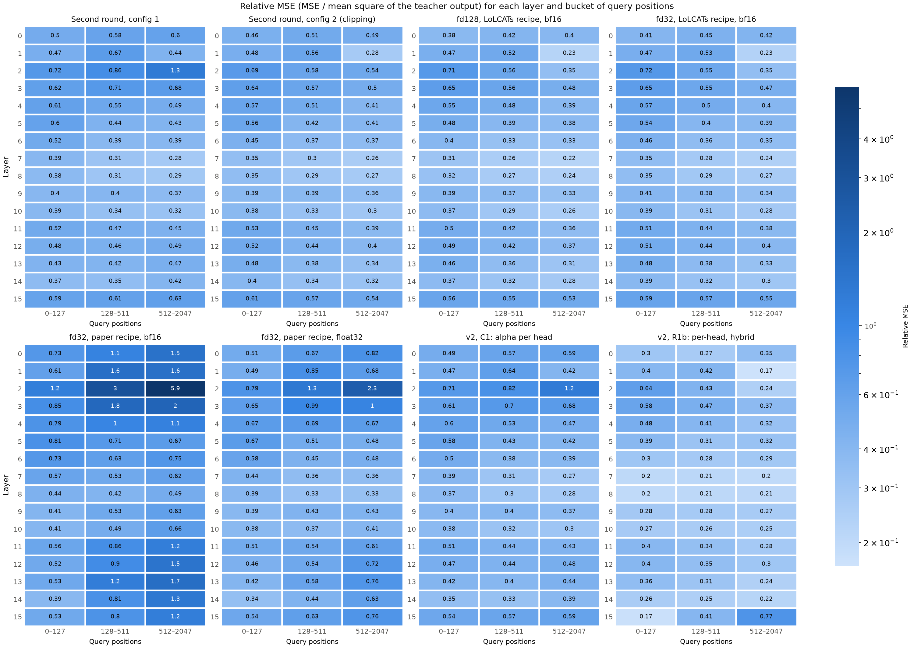
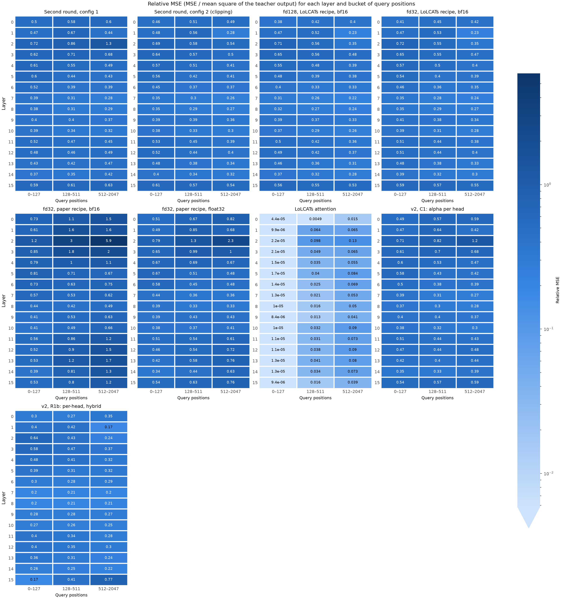
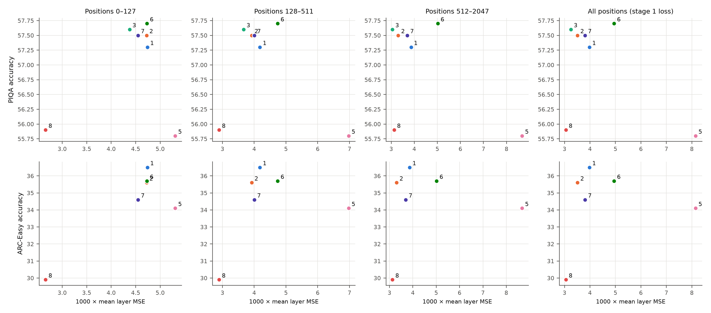
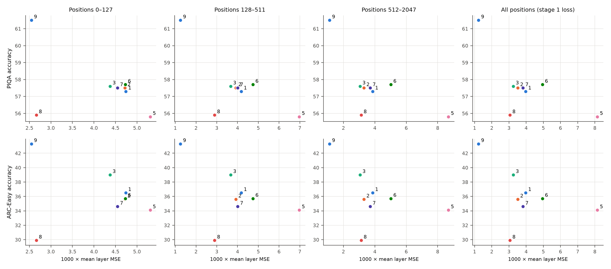

# Experiment (XAI): MSE by token position

**Status:** Run 1 finished on 2026-10-09: all 9 stage 1 checkpoints. LoLCATs computes the teacher attention at positions 0–127. Lizard misses 35–63% of the teacher output there, most of all in layers 2 and 3. But the MSE of these positions does not predict PIQA or ARC-Easy over the Lizard checkpoints. The hypothesis of X1 does not hold. Run 2 on 2026-10-10 added `window_rope` and the ARC-Easy of Lizard Run 1. `window_rope` has the lowest MSE at positions 0–127 and the highest accuracy of the Lizard checkpoints. The rank test still gives no significant result.

## Question

This is X1 of [document 20](../20-layer-mse-for-piqa-arc.md). In which query positions is the error of the stage 1 attention? Does the MSE of positions 0–127 order the stage 1 checkpoints as PIQA and ARC-Easy do?

## Why the position matters

- **PIQA and ARC-Easy use short prompts.** 95% of the prompts have fewer than approximately 90 tokens ([document 20](../20-layer-mse-for-piqa-arc.md), section 2). Thus for almost every question, all keys are inside the window of 128 tokens.
- **Positions 0–127 have the same case.** The validation data has 16 sequences of 2048 tokens. A query at position i sees the keys 0 to i of its sequence. For i < 128, all these keys are inside the window.
- **The stage 1 loss gives these positions little weight.** Positions 0–127 are 6.25% of the 2048 positions. The other 93.75% have keys outside the window.
- **The stage 1 loss does not predict the accuracy.** [Document 14](../14-liger-gla.md), section 5, compares 6 Lizard runs. The rank correlation between the loss and the accuracy is +0.31 for ARC-Easy and −0.06 for PIQA.

**Hypothesis:** the MSE of positions 0–127 predicts PIQA and ARC-Easy better than the stage 1 loss.

**A difference to the benchmarks.** The data loader packs Alpaca samples into sequences of 2048 tokens. Thus a validation sequence usually starts inside a sample, and its first token is usually not the first token of a text. A PIQA prompt starts at the beginning of its text.

## What the script calculates

`compute` uses the model, the data and the checkpoint of `scripts/layer_mse.py` ([XAI: layer-wise MSE](xai-layer-wise-mse.md)). `--from_json` takes the model config, the distill config, the checkpoint and the label from a result of `layer_mse.py`.

- Each attention layer runs in distillation mode. It calculates the teacher output and the student output from the same q, k and v. Each layer gets the teacher input.
- **Buckets:** `--edges 0,128,512,2048` (the default) gives the query positions 0–127, 128–511 and 512–2047.
- **For each layer and bucket:** the MSE, the mean square of the teacher output, the relative MSE, and the MSE of each head.
- **For each bucket:** 1000 × the mean MSE over the layers (the scale of the stage 1 loss), and the mean relative MSE.
- **Checks:**
  1. For each layer, the bucket MSEs, weighted by their number of positions, give the MSE over all positions. The script stops if the relative difference is above 1e-4.
  2. 1000 × the mean layer MSE over all positions is the stage 1 validation loss. With all batches, it must agree with the loss in the checkpoint, as in `layer_mse.py`.

`rank` reads the results of several checkpoints and the accuracy table [`accuracy.csv`](xai-position-mse/accuracy.csv).

- **Scores:** the loss of each bucket, and the stage 1 loss over all positions for comparison.
- **For each score and task:** the rank correlation (Spearman) ρ, the two-sided permutation p-value, and the number of checkpoints n. A negative ρ means that a lower MSE comes with a higher accuracy.
- **Ties:** tied values get their mean rank. The p-value is exact up to 9 checkpoints.
- `--exclude` removes a checkpoint by its label, for example the LoLCATs control.
- **Output:** `OUT.md` with the tables, and `OUT.png` with the accuracy against the loss of each bucket.

`heatmap` draws one heatmap for each result: the layers in the rows, the buckets in the columns.

- **Value:** the relative MSE by default, because it compares the layers ([XAI: layer-wise MSE](xai-layer-wise-mse.md), finding 3). `--absolute` gives 1000 × MSE.
- **Color:** one blue scale for all panels, light for small values and dark for large values. Each cell also shows its value.
- **Log scale:** if the values span more than a factor of 20, the scale is logarithmic over at most 3 decades. Smaller values, such as the bf16 rounding of LoLCATs, get the lightest color.
- **Output:** `OUT.png`, and `OUT.md` with the same values as tables.
- **A finer grid:** compute with more edges, for example `--edges 0,64,128,256,512,1024,2048`.

## The accuracy table

| Checkpoint (label) | PIQA | ARC-Easy | Source |
|---|---|---|---|
| fd32, LoLCATs recipe, bf16 | – | – | [Feature dimension](feature-dimension.md) |
| fd128, LoLCATs recipe, bf16 (Lizard Run 1) | 57.6 | 39.0 | [Stage difference](stage-difference.md) (PIQA), [RoPE in the window branch](window-rope.md) (ARC-Easy) |
| fd32, paper recipe, bf16 | 55.8 | 34.1 | [Paper LR](paper-lr.md) |
| fd32, paper recipe, float32 | 57.7 | 35.7 | [float32](float32.md) |
| Second round, config 1 | 57.3 | 36.5 | [Second round](second-round.md) |
| Second round, config 2 (clipping) | 57.5 | 35.6 | [Gradient clipping](gradient-clipping.md) |
| v2, C1: alpha per head | 57.5 | 34.6 | [Document 13](../13-lizard-attention-v2.md) |
| v2, R1b: per-head, hybrid | 55.9 | 29.9 | [Document 13](../13-lizard-attention-v2.md) |
| v2, window_rope, fd128, LoLCATs recipe, bf16 | 61.5 | 43.3 | [RoPE in the window branch](window-rope.md) |
| LoLCATs attention | 73.5 | 62.8 | [LoLCATs control](lolcats-control.md) |

Two values are not measured: fd32 with the LoLCATs recipe. Run 1 used 9 checkpoints, without the ARC-Easy of Lizard Run 1. Run 2 added this value and the `window_rope` row.

## Predictions

1. **LoLCATs:** the relative MSE of positions 0–127 is near 0. The terraced window gives exact softmax attention up to position 255 ([LoLCATs control](lolcats-control.md), finding 2). Only bf16 rounding remains. Positions 128–511 have a larger MSE, because positions 256–511 have keys outside the window.
2. **Lizard:** the relative MSE of positions 0–127 is clearly above that of LoLCATs in every checkpoint. The window has no RoPE, and the gated branch adds weight inside the window ([document 15](../15-attention-math-side-by-side.md), claims B, C and F).
3. **The main test:** if the hypothesis holds, the loss of positions 0–127 has a negative ρ. Its |ρ| is larger than for the stage 1 loss. This must also hold without LoLCATs.

## Limits of the rank test

- **Few checkpoints.** With LoLCATs, PIQA has 8 checkpoints and ARC-Easy 7. Without LoLCATs, they have 7 and 6. For p < 0.05 without ties, |ρ| must be at least 0.738 (n = 8), 0.786 (n = 7) or 0.886 (n = 6).
- **The PIQA values of Lizard are close.** They are 55.8–57.7, a spread of 1.9 points. One SE is 1.2 points, so the SE of a difference is approximately 1.7 points. Thus the PIQA order of the Lizard checkpoints is mostly noise. ARC-Easy spreads over 6.6 points (29.9–36.5), mainly because of R1b.
- **LoLCATs dominates the test with all checkpoints.** LoLCATs has the lowest loss and the highest accuracy. Thus each score that puts LoLCATs lowest gets a negative ρ. The stage 1 loss also puts LoLCATs lowest. Thus the test without LoLCATs is the important one.
- **One data set.** The MSE comes from Alpaca validation data, not from PIQA or ARC-Easy prompts.

## How to run

On the A10 (`student06`, GPU 0), in the `lolcats-env` environment, from the repository root:

```bash
mkdir -p results/position_mse
for name in fd32_lolcats fd128_lolcats fd32_paper_bf16 fd32_paper_fp32 config1 v2_alphahead \
            v2_perhead_hybrid lolcats_attention_fd128; do
  CUDA_DEVICE_ORDER=PCI_BUS_ID CUDA_VISIBLE_DEVICES=0 python scripts/position_mse.py compute \
    results/position_mse/$name.json --from_json docs/experiments/xai-layer-wise-mse/$name.json \
    --cache_dir ~/.cache/huggingface/hub
done

# Config 2 (gradient clipping) has PIQA and ARC-Easy, but no result of layer_mse.py yet
CUDA_DEVICE_ORDER=PCI_BUS_ID CUDA_VISIBLE_DEVICES=0 python scripts/position_mse.py compute \
  results/position_mse/config2.json --label "Second round, config 2 (clipping)" \
  --model_config distill_llama3_2_1b_lizard_w128_fd32_m4_fp32 \
  --distill_config distill_alpaca_clean_xent0_mse1000_lr1e-3_paper_1b --cache_dir ~/.cache/huggingface/hub

# Rank correlations, with and without the LoLCATs control
python scripts/position_mse.py rank results/position_mse/rank_all results/position_mse/*.json \
  --accuracy docs/experiments/xai-position-mse/accuracy.csv
python scripts/position_mse.py rank results/position_mse/rank_lizard results/position_mse/*.json \
  --accuracy docs/experiments/xai-position-mse/accuracy.csv --exclude "LoLCATs attention"

# Heatmaps: all checkpoints (log scale), and Lizard alone (linear scale, more detail)
python scripts/position_mse.py heatmap results/position_mse/heatmap_all $(ls results/position_mse/*.json)
python scripts/position_mse.py heatmap results/position_mse/heatmap_lizard \
  $(ls results/position_mse/*.json | grep -v lolcats_attention)

zip -r position-mse-$(date +%Y%m%d-%H%M).zip results/position_mse
```

- Each `compute` runs the same forward passes as `layer_mse.py compute`, thus a few minutes for each checkpoint (an estimate).
- The checkpoints are the checkpoints of the [layer-wise MSE](xai-layer-wise-mse.md) runs. A checkpoint that is not local comes from `HF_REPO`.
- With all batches, each result prints the difference to the stored loss. The earlier runs of `layer_mse.py` give the expected values: 0.000% for float32, −0.10% to −0.21% for bf16.

**Evaluations that complete the accuracy table** (optional, minutes each). Add the values to `accuracy.csv`, then run `rank` again.

```bash
CUDA_DEVICE_ORDER=PCI_BUS_ID CUDA_VISIBLE_DEVICES=0 MODELS=stage1 TASKS=arc_easy scripts/compare_stages.sh
CUDA_DEVICE_ORDER=PCI_BUS_ID CUDA_VISIBLE_DEVICES=0 MODEL_CONFIG=distill_llama3_2_1b_lizard_w128_fd32_m4 \
  MODELS=stage1 TASKS="piqa arc_easy" scripts/compare_stages.sh
```

The first command evaluates Lizard Run 1 stage 1 (fd128). The second command evaluates fd32 with the LoLCATs recipe.

## Tests

CPU, 2026-10-09, in a copy of the repository with tiny random Llama models and a small Alpaca file. The configs of the copy point to these models.

| Check | Result |
|---|---|
| `layer_mse.py` after the change (its loading part is now the function `load`, which `position_mse.py` uses) | The same values for each layer as before the change. Tiny Lizard, 3 layers: loss 6486.9407, equal to the stored loss. |
| `compute` on tiny Lizard (window 16, sequences of 64 tokens, `--edges 0,16,32,64`, `--from_json`) | The loss equals the loss of `layer_mse.py` and the stored loss. Largest difference of the bucket check: 1.1e-8. |
| `compute` on tiny LoLCATs (window 128, sequences of 1024 tokens, `--edges 0,128,256,512,1024`) | 1000 × MSE of approximately 1e-10 at positions 0–127 and 128–255, and 2,909 and 2,896 at positions 256–511 and 512–1023. Thus the error starts at position 256, where the terraced window ends. The loss equals the stored loss (2175.1218). |
| Default edges with sequences of 1024 tokens | Buckets 0–127, 128–511 and 512–1023. The script cuts the edge 2048 to the sequence length. |
| `rank` on synthetic results with the 9 labels of `accuracy.csv` | A score equal to 100 − PIQA gives ρ = −1.00 with p = 9.9e-5. Two PIQA values tie (57.5), so 4 of the 40,320 orders reach \|ρ\| = 1. All ρ values equal `scipy.stats.spearmanr`. The p-values agree with the sampled permutation test of scipy. |
| `rank --exclude "LoLCATs attention"` | 8 of 9 results remain |
| `heatmap` on the tiny results (3 and 4 buckets in one figure) | One panel for each result. LoLCATs at positions 0–255 gets the lightest color, with its value (approximately 3e-14 and 7e-14) in the cells. |
| `heatmap` on 8 synthetic results (16 layers, 3 buckets) | A 2 × 4 grid. With LoLCATs: a log scale. Without LoLCATs: a linear scale, and the eighth panel stays empty. `--absolute` writes 1000 × MSE. |

The values of the tiny models do not predict the values at 1B.

## Results

### Run 1: all 9 stage 1 checkpoints (2026-10-09)

- **Commands:** `position_mse.py compute` for each checkpoint, then `rank` with and without LoLCATs, and `heatmap` for all checkpoints and for Lizard alone. The same loop also ran `layer_mse.py` ([XAI: layer-wise MSE](xai-layer-wise-mse.md), Run 3).
- **Machine and code:** `student06`, lolcats `5a2097c`, torch 2.5.1. Data: all 16 validation batches (32,768 tokens).
- **GPUs:** the session did not restrict the GPUs (`CUDA_VISIBLE_DEVICES` was not active). Thus the model ran on several GPUs of `student06`. The checks below show that the values are valid.
- **Checks:**
  - All expected keys loaded: 80 for each Lizard checkpoint, 48 for LoLCATs. 0 missing, 0 unexpected.
  - Each checkpoint reproduces its stored loss: +0.000% for float32, −0.107% to −0.223% for bf16, and +0.044% for LoLCATs.
  - The earlier runs of `layer_mse.py` on the A10 give the same values for each layer: equal for float32, within 0.073% for bf16.
  - The buckets add up to the MSE over all positions, with a relative difference of 4.2e-8 to 6.7e-8.
- **Files in [`xai-position-mse/`](xai-position-mse/):** the 9 JSON files, and `rank_all`, `rank_lizard`, `heatmap_all` and `heatmap_lizard` (each as `.md` and `.png`).

#### Means over the layers

Loss: 1000 × the mean MSE over the layers. Relative: the mean relative MSE over the layers.

| Checkpoint | Loss 0–127 | Loss 128–511 | Loss 512–2047 | Stage 1 loss | Relative 0–127 | Relative 128–511 | Relative 512–2047 |
|---|---|---|---|---|---|---|---|
| fd32, LoLCATs recipe, bf16 | 4.643 | 3.828 | 3.213 | 3.418 | 0.488 | 0.423 | 0.357 |
| fd128, LoLCATs recipe, bf16 | 4.375 | 3.668 | 3.054 | 3.251 | 0.463 | 0.407 | 0.341 |
| fd32, paper recipe, bf16 | 5.309 | 6.976 | 8.677 | 8.146 | 0.629 | 1.025 | 1.420 |
| fd32, paper recipe, float32 | 4.731 | 4.740 | 5.018 | 4.948 | 0.514 | 0.605 | 0.721 |
| Second round, config 1 | 4.738 | 4.180 | 3.862 | 3.976 | 0.499 | 0.492 | 0.501 |
| Second round, config 2 (clipping) | 4.722 | 3.919 | 3.306 | 3.509 | 0.491 | 0.438 | 0.385 |
| v2, C1: alpha per head | 4.548 | 4.002 | 3.699 | 3.809 | 0.486 | 0.475 | 0.486 |
| v2, R1b: per-head, hybrid | 2.661 | 2.892 | 3.127 | 3.054 | 0.351 | 0.325 | 0.301 |
| LoLCATs attention | 0.000113 | 0.240 | 0.533 | 0.444 | 0.0000151 | 0.035 | 0.067 |

#### Heatmaps





#### Rank correlations

Without LoLCATs ([`rank_lizard.md`](xai-position-mse/rank_lizard.md)):

| Score | PIQA ρ | PIQA p | PIQA n | ARC-Easy ρ | ARC-Easy p | ARC-Easy n |
|---|---|---|---|---|---|---|
| Positions 0–127 | −0.23 | 0.62 | 7 | +0.43 | 0.42 | 6 |
| Positions 128–511 | −0.09 | 0.86 | 7 | +0.31 | 0.56 | 6 |
| Positions 512–2047 | −0.23 | 0.62 | 7 | +0.31 | 0.56 | 6 |
| All positions (stage 1 loss) | −0.09 | 0.86 | 7 | +0.31 | 0.56 | 6 |

With LoLCATs ([`rank_all.md`](xai-position-mse/rank_all.md)), all scores give ρ = −0.40 to −0.49 for PIQA (p = 0.22–0.33) and −0.11 to −0.18 for ARC-Easy (p = 0.71–0.84).



#### Findings

**Finding 1: LoLCATs computes the teacher attention at positions 0–127 (prediction 1 holds)**. Its relative MSE there is 8.4e-6 to 4.4e-5 in each layer, which is bf16 rounding. At positions 128–511, it is 0.005–0.098, and at 512–2047, 0.015–0.133.

**Finding 2: Lizard misses 35–63% of the teacher output where all keys are inside the window (prediction 2 holds)**. The mean relative MSE of positions 0–127 is 0.351–0.629 for the 8 Lizard checkpoints. This is more than 20,000 times the value of LoLCATs. PIQA and ARC-Easy prompts are almost always in this case.

**Finding 3: layers 2 and 3 have the largest error at short positions**. Layer 2 has the largest relative MSE at positions 0–127 in all 8 Lizard checkpoints (0.64–1.17). Layer 3 is second in 7 of 8. Layer 0 has 0.30–0.73 there. Layer 0 is the worst layer in the attention weights ([sample attention weights](xai-sample-attention-weight.md), finding 7), but not in this measure.

**Finding 4: the change with the position depends on the recipe**.

- **LoLCATs recipe (fd32, fd128) and config 2:** positions 0–127 have a larger error than positions 512–2047 in 15 of 16 layers. Thus for these runs, short contexts are the hardest case.
- **Recipe of the paper:** the error increases with the position, from 0.629 to 1.420 (bf16) and from 0.514 to 0.721 (float32). In these runs, the gate of the first layers decays fast ([XAI: layer-wise MSE](xai-layer-wise-mse.md), interpretation). A short memory of the gated branch agrees with this pattern.
- **Config 1 and C1:** almost the same error in all three buckets.

**Finding 5: in R1b, layer 15 becomes a local layer**. Its relative MSE is 0.17 at positions 0–127 and 0.77 at positions 512–2047. In R1b, the shared gate of layer 15 fell to 0.128, so the gated branch keeps approximately one token back ([document 13](../13-lizard-attention-v2.md), finding 4). This helps short contexts and hurts long contexts. R1b has the lowest error at positions 0–127 of all Lizard checkpoints.

**Finding 6: the MSE of positions 0–127 does not predict the accuracy (prediction 3 does not hold)**.

- Without LoLCATs, its ρ is −0.23 for PIQA and +0.43 for ARC-Easy. The stage 1 loss gives −0.09 and +0.31. A positive ρ means that a lower loss comes with a lower accuracy. No p is below 0.42.
- R1b has the lowest loss at positions 0–127 and the lowest ARC-Easy (29.9).
- A check without R1b and LoLCATs: ρ = −0.64 for PIQA (p = 0.2, n = 6) and 0.00 for ARC-Easy (n = 5). The stage 1 loss gives −0.41 and −0.20. With these few checkpoints, this is no clear result.

**Interpretation**. Inside the Lizard family, a lower error at short positions does not give a higher accuracy. All Lizard checkpoints have more than 20,000 times the error of LoLCATs at these positions. One possible reading: the accuracy changes only when the error at short positions falls near 0, as for LoLCATs. The differences between 0.35 and 0.63 then do not show in the accuracy. This is a hypothesis with one control checkpoint.

#### Check of the predictions

| Prediction | Result | Holds |
|---|---|---|
| 1. LoLCATs near 0 at positions 0–127 | 8.4e-6 to 4.4e-5 in each layer (finding 1) | Yes |
| 2. Lizard clearly above LoLCATs at positions 0–127 | 0.351–0.629, more than 20,000 times LoLCATs (finding 2) | Yes |
| 3. The MSE of positions 0–127 predicts the accuracy better than the stage 1 loss | No significant ρ. Without LoLCATs, ARC-Easy has a positive ρ (finding 6). | No |

#### Decision

- **Screen:** prediction 3 does not hold. Thus the accuracy stays the screen for new stage 1 runs. The position buckets still show where a change acts.
- **First change:** prediction 2 holds, and the largest error at positions 0–127 is in layers 2 and 3. This supports `window_rope` as the first change (step 2 of [document 20](../20-layer-mse-for-piqa-arc.md), section 5).
- **Check for `window_rope`:** the relative MSE of positions 0–127 must decrease clearly in layers 0–3. Finding 6 says that a small decrease is not sufficient. Only an evaluation on PIQA and ARC-Easy can show an effect on the accuracy.

### Run 2: `window_rope` and the ARC-Easy of Lizard Run 1 (2026-10-10)

- **Commands:** the evaluation block of [RoPE in the window branch](window-rope.md) on `student06` (one A10, lolcats `02b4ce9`). It ran `position_mse.py compute` for `window_rope`, and ARC-Easy for Lizard Run 1. Then `rank` ran on a CPU with the 10 JSON files and the new accuracy table.
- **Checks:** all 80 expected keys loaded. The buckets add up to the MSE over all positions, with a relative difference of 3.6e-8. The loss differs from the stored loss by +0.16%.
- **Files in [`xai-position-mse/`](xai-position-mse/):** [`v2_window_rope.json`](xai-position-mse/v2_window_rope.json), and `rank_all_run2` and `rank_lizard_run2` (each as `.md` and `.png`). The files of Run 1 stay unchanged. The heatmap against Lizard Run 1 is in [RoPE in the window branch](window-rope.md), "Plots".

| Checkpoint | Loss 0–127 | Loss 128–511 | Loss 512–2047 | Stage 1 loss | Relative 0–127 | Relative 128–511 | Relative 512–2047 |
|---|---|---|---|---|---|---|---|
| v2, window_rope, fd128, LoLCATs recipe, bf16 | 2.548 | 1.250 | 1.116 | 1.231 | 0.321 | 0.168 | 0.141 |

Rank correlations without LoLCATs ([`rank_lizard_run2.md`](xai-position-mse/rank_lizard_run2.md)):

| Score | PIQA ρ | PIQA p | PIQA n | ARC-Easy ρ | ARC-Easy p | ARC-Easy n |
|---|---|---|---|---|---|---|
| Positions 0–127 | −0.49 | 0.22 | 8 | −0.26 | 0.54 | 8 |
| Positions 128–511 | −0.40 | 0.33 | 8 | −0.31 | 0.46 | 8 |
| Positions 512–2047 | −0.49 | 0.22 | 8 | −0.45 | 0.27 | 8 |
| All positions (stage 1 loss) | −0.40 | 0.33 | 8 | −0.31 | 0.46 | 8 |

With LoLCATs ([`rank_all_run2.md`](xai-position-mse/rank_all_run2.md)), n is 9. The scores give ρ = −0.58 to −0.64 for PIQA (p = 0.068–0.11), and −0.48 to −0.62 for ARC-Easy (p = 0.086–0.19).



**Finding 7: `window_rope` has the lowest error at positions 0–127 of all Lizard checkpoints, and the highest accuracy**. Its relative MSE there is 0.321, against 0.351–0.629 for the 8 earlier Lizard checkpoints. Its PIQA (61.5) and ARC-Easy (43.3) are the highest of the Lizard checkpoints. The ARC-Easy of Lizard Run 1 is 39.0, the highest of the 7 earlier checkpoints with an ARC-Easy score.

**Finding 8: the rank test still gives no significant result**. Without LoLCATs, all ρ values are now negative, but no p is below 0.22. The score of positions 0–127 is not better than the score of positions 512–2047. One checkpoint, `window_rope`, has the lowest loss in all buckets and the highest accuracy. It gives most of the change against Run 1. Thus prediction 3 still does not hold.

**Finding 9: in `window_rope`, short positions have the largest error**. Positions 0–127 have 1.9× and 2.3× the relative MSE of the other two buckets. From Run 1, the error of positions 0–127 decreased by 31%, and that of the other buckets by 59%. Layers 2 and 3 still have the largest error at positions 0–127 (0.593 and 0.538). Layer 0 has 0.154 there (Run 1: 0.383). Thus the check for `window_rope` holds for layers 0 and 1, but only a little for layers 2 and 3. The branch decomposition shows the cause: the mix of the branches ([RoPE in the window branch](window-rope.md), findings 6 to 8).

## Decision rules

From [document 20](../20-layer-mse-for-piqa-arc.md), section 4:

- **The hypothesis holds without LoLCATs** (prediction 3). Then use the loss of positions 0–127 as a screen for new stage 1 runs, together with the accuracy.
- **It does not hold:** keep the accuracy as the screen. The position buckets then still show where each change acts.
- **Prediction 2 holds, and the relative MSE of positions 0–127 is largest in the first layers.** This supports `window_rope` as the first change. It is step 2 of [document 20](../20-layer-mse-for-piqa-arc.md), section 5.
