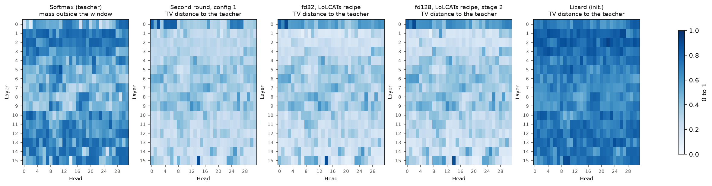
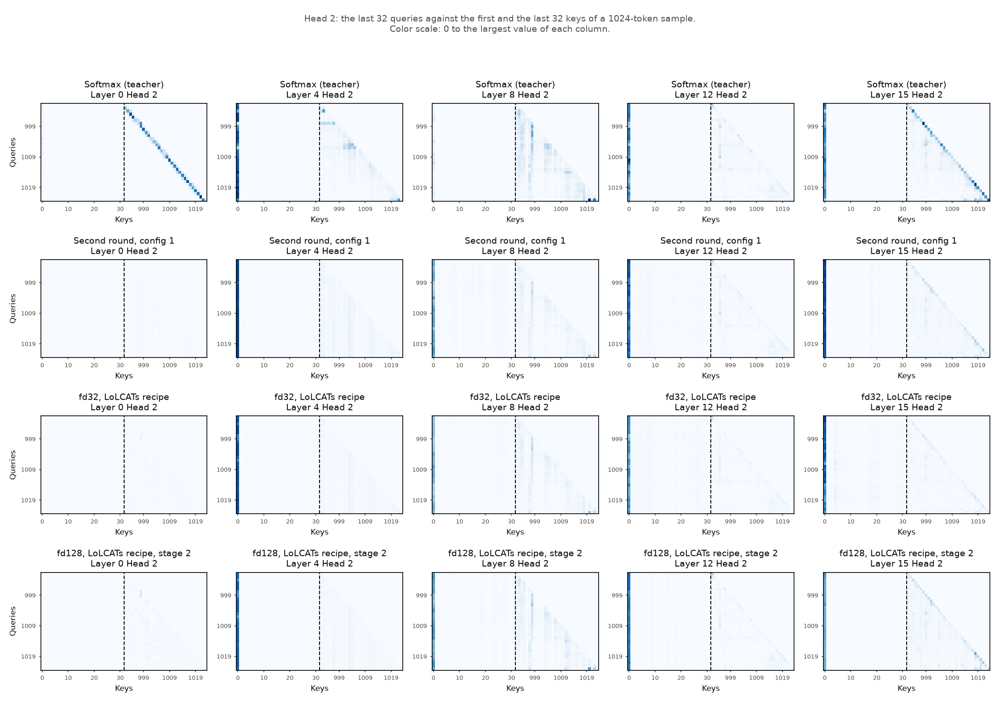
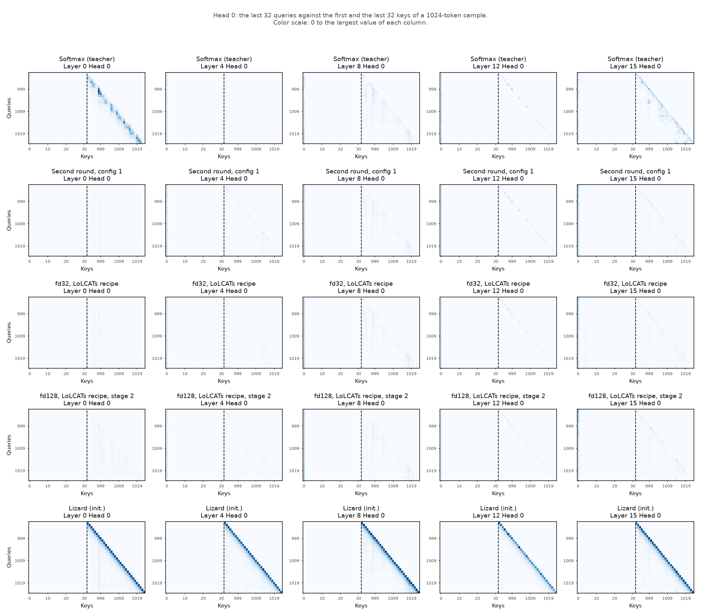

# Experiment (XAI): sample attention weights

**Status:** Run 1 finished on 2026-10-02: four checkpoints, heads 0–3. Trained Lizard reproduces long-range heads well and local heads badly. Layer 15, head 14 is a local head in the teacher.

## Question

Stage 1 trains Lizard to reproduce the attention **outputs** of the teacher (MSE loss). Does Lizard then also reproduce the attention **weights** of the teacher? Does it reproduce them over distances outside its window of 128 tokens?

The [layer-wise MSE experiment](xai-layer-wise-mse.md) shows where the outputs differ. Its largest single source of error is heads 14 and 23 of layer 15. A possible cause is attention to tokens far outside the window. The attention weights can test this hypothesis directly.

## The figures of LoLCATs

Appendix E.2 of the LoLCATs paper ("Sample Attention Weights", Figures 18–21) shows sample attention weights of Llama 3 8B:

- **Samples:** held-out packed Alpaca samples of 1024 tokens.
- **Panels:** the last 32 queries against the first 32 and the last 32 keys. A dashed line separates the two key groups. The distance between the last queries and the first keys is much larger than the window of LoLCATs (64 tokens).
- **Rows:** softmax attention, LoLCATs (MSE), LoLCATs (XENT), Hedgehog (MSE), LoLCATs (init.) and Hedgehog (init.).
- **Columns:** layers 0, 8, 16, 24 and 31. Figures 18–21 show heads 0–3, one figure for each head.

The paper reports these observations:

- The training of LoLCATs uses only the attention outputs (MSE). LoLCATs often recovers the softmax attention weights qualitatively, with a quality comparable to an explicit loss on the weights (XENT).
- LoLCATs often recovers the weights over distances outside its window. Thus it learns both the feature maps and the weighting factors.
- Newly initialized LoLCATs layers do not capture the softmax attention weights (init.). Thus attention transfer is necessary.
- Trained LoLCATs layers match the weights better than trained Hedgehog layers (the same feature map, but no sliding window).

## The attention weights of Lizard

**Teacher**. The teacher uses causal softmax attention with RoPE ([math formulas](../math-formula.md), section 3):

```math
A^{T}_{i,t} = \frac{\exp\left( \varphi_R(\mathbf{q}_i)^\top \varphi_R(\mathbf{k}_t) / \sqrt{d} \right)}{\sum_{j \le i} \exp\left( \varphi_R(\mathbf{q}_i)^\top \varphi_R(\mathbf{k}_j) / \sqrt{d} \right)}, \qquad t \le i
```

**Lizard**. The output of a Lizard layer is a weighted sum of the values too. Thus it has an exact weight matrix $A$ with $\hat{\mathbf{y}}_i = \sum_t A_{i,t} \mathbf{v}_t$:

```math
A = A^{gla} + \alpha \, A^{window}
```

```math
A^{gla}_{i,t} = \frac{\phi_q(\mathbf{q}_i)^\top \phi_k(\mathbf{k}_t) \prod_{l=t+1}^{i} \gamma_l}{\sum_{j \le i} \phi_q(\mathbf{q}_i)^\top \phi_k(\mathbf{k}_j) \prod_{l=j+1}^{i} \gamma_l}, \qquad A^{window}_{i,t} = \frac{\exp\left( \mathbf{q}_i^\top \mathbf{k}_t / \sqrt{d} \right)}{\sum_{j} \exp(t_j) + \sum_{t' = i-w+1}^{i} \exp\left( \mathbf{q}_i^\top \mathbf{k}_{t'} / \sqrt{d} \right)}
```

$A^{window}_{i,t}$ is 0 for keys outside the window ($t \le i - w$). The code calculates the same terms (`gla`, `awa` and `sink_softmax` in `lizard_attention.py`).

Two differences to softmax attention matter for the plots:

- **The rows of $A$ do not sum to 1**. $A^{gla}$ sums to 1. The sinks take a part of the window mass. Thus a row of $A$ sums to $1 + \alpha \, (1 - \text{sink mass})$. The plots show $A$ unchanged. The total variation distance (below) normalizes the rows first.
- **Lizard has no RoPE**. Both branches use q and k before RoPE ([math against code](../math-code-discrepancy.md)). Thus Lizard cannot use the relative position of two tokens directly, also inside the window.

## Differences to the figures of LoLCATs

| Item | LoLCATs | This experiment |
|---|---|---|
| Model | Llama 3 8B, 32 layers | Llama 3.2 1B, 16 layers |
| Window | 64 tokens | 128 tokens. The last 32 queries and the first 32 keys are more than 960 tokens apart. |
| Columns | Layers 0, 8, 16, 24, 31 | Default layers 0, 4, 8, 12, 15: the same fractions of the depth |
| Rows | Softmax, then the trained and the initialized attention types | Softmax (teacher), then one row for each result file (stage 1, stage 2 or init.) |
| Color scale | Not given | Shared in each column: 0 to the largest value of the column. Thus the rows of one column are comparable. |
| Layer input | Not given | Default `--inputs teacher`: each Lizard layer gets the input of the same teacher layer. `--inputs own`: the Lizard model runs on its own hidden states. |

## What the script calculates

`python scripts/attention_weights.py compute` writes one JSON file for one checkpoint:

- **Samples:** the stage 1 validation split (the first 200 examples of Alpaca-cleaned, not used in training), packed into chunks of `--seq_len` tokens (default 1024). `--samples` sets the number of chunks (default 1).
- **Checkpoint:** stage 1 (default), stage 2, or the initial Lizard weights (`--checkpoint init`, seed 0). With `--stage 2`, the script loads the stage 1 checkpoint and then the LoRA weights of stage 2.
- **Crops:** the panels of the figure for `--layers` and `--heads` (default heads 0–3). Each crop is the last `--queries` queries (default 32) against the first and the last `--queries` keys. The file has a crop for the teacher, for Lizard ($A$) and for the gated branch ($A^{gla}$).
- **Metrics for all layers and heads:** means over the queries at or after the window (these queries have keys outside the window):

| Metric | Meaning |
|---|---|
| `teacher_first_key`, `lizard_first_key` | The weight on the first key of the sample. In many teacher layers, the first key is an attention sink. |
| `teacher_outside_window`, `lizard_outside_window` | The sum of the weights on keys outside the window. For Lizard, only the gated branch can give such weight. |
| `tv_distance` | The total variation distance between the teacher row and the normalized Lizard row: 0.5 × the sum of the absolute differences. 0 means equal rows. 1 means no overlap. |
| `row_sum` | The sum of a Lizard row: $1 + \alpha \, (1 - \text{sink mass})$ |
| `window_share` | The share of the Lizard row from the window branch: $\alpha \sum_t A^{window}_{i,t}$ / row sum |
| `window_sink_mass` | The mass that the sinks take in the window branch |

`python scripts/attention_weights.py plot` reads one or more JSON files. It writes:

- one PNG for each head (`OUT_head<h>.png`), with the layout of Figures 18–21. The first row is the teacher of the first file.
- `OUT_metrics.png`: for all layers and heads, the mass of the teacher outside the window, and the TV distance of each result.
- `OUT_metrics.md`: the metrics as tables. One table has the means for each layer. One table for each result has the heads with the largest TV distance.

### Checks

The script checks both weight matrices in every layer:

- **Teacher:** $A^{T}$ times v, through `o_proj`, against the output of the teacher layer. A check without RoPE gave a relative error of 0.89. Thus the check finds a wrong teacher matrix.
- **Lizard:** $A$ times v against the output of the Lizard layer (`lizard`).

Each log ends with the largest relative error of the checks.

**Stage 2 runs in the dtype of the model config**. `create_peft_config` (`src/model/peft.py`) casts the whole model to `target_dtype`, with bf16 as the default. The evaluation (`load_model_for_eval.py`), the stage 2 training and the script give it the dtype of the model config ([stage 2 on config 1](stage2-config1.md)). Thus a stage 2 model with a float32 model config is float32. Before this change, every stage 2 model was bf16, and the Lizard check had the size of bf16 rounding (approximately 2e-3).

## Predictions

1. **Initialization**: the initialized Lizard layers do not reproduce the teacher weights, as in LoLCATs. At initialization, γ = 0.5. Thus the gated branch keeps only 0.5^10 ≈ 0.001 of a token 10 positions back. The first keys stay empty, and the mass outside the window is approximately 0.
2. **The first key**: in many middle layers, the teacher puts much weight on the first key (as in Figure 18, layers 8–24). Lizard can reach this key only through the gated branch. With the LoLCATs recipe, the gate saturates, so the gated branch can keep the first key. With the recipe of the paper, the gate decays fast in some layers. Thus the LoLCATs-recipe checkpoints probably put more weight on the first key. This relates to the sink hypothesis (section 13.2 of the [gap analysis](../11-gap-analysis.md)).
3. **Inside the window**: trained Lizard reproduces patterns that depend on the content of the tokens. Patterns that depend on the position, such as a sharp diagonal, are harder without RoPE.
4. **Layer 15, heads 14 and 23**: the teacher puts much weight outside the window, and Lizard misses most of it. Then these heads have a large TV distance.

## How to run

Run the commands from the repository root on the A10, in the `lolcats-env` environment. As in `layer_mse.py`, the script finds the checkpoint names from the configs and downloads missing files from `HF_REPO`:

```bash
conda activate lolcats-env
export HF_TOKEN=<token with access to HF_REPO and meta-llama/Llama-3.2-1B>
export CUDA_DEVICE_ORDER=PCI_BUS_ID CUDA_VISIBLE_DEVICES=0
CACHE=$HOME/.cache/huggingface/hub
run() {  # output name, label, model config, distill config, other options
  python scripts/attention_weights.py compute "results/attention_weights/$1.json" --label "$2" \
    --model_config "$3" --distill_config "$4" --cache_dir "$CACHE" "${@:5}" 2>&1 | tee "results/attention_weights/$1.log"
}
mkdir -p results/attention_weights
run fd32_lolcats "fd32, LoLCATs recipe" distill_llama3_2_1b_lizard_w128_fd32_m4 distill_alpaca_clean_xent0_mse1000_lr1e-2_1b
run config1 "Second round, config 1" distill_llama3_2_1b_lizard_w128_fd32_m4_fp32 distill_alpaca_clean_xent0_mse1000_lr1e-3_paper_noclip_1b
run init "Lizard (init.)" distill_llama3_2_1b_lizard_w128_fd32_m4_fp32 distill_alpaca_clean_xent0_mse1000_lr1e-3_paper_noclip_1b --checkpoint init
run fd128_stage2 "fd128, LoLCATs recipe, stage 2" distill_llama3_2_1b_lizard_w128_fd128_m4 distill_alpaca_clean_xent0_mse1000_lr1e-2_1b --stage 2

python scripts/attention_weights.py plot results/attention_weights/heads0-3 \
  results/attention_weights/config1.json results/attention_weights/fd32_lolcats.json \
  results/attention_weights/fd128_stage2.json results/attention_weights/init.json
```

- The first file of `plot` gives the teacher row. The first file above uses a float32 model config, so the teacher row is float32.
- `--stage 2` uses the stage 2 checkpoint name of `compare_stages.sh`. For another name, give `--finetune_checkpoint`.
- For prediction 4, add the crops of the heads with the largest MSE. For example: `--layers 13 14 15 --heads 14 23`, with other output names. The metrics already cover all layers and heads.

## How to read the result

| Result | Meaning |
|---|---|
| A trained row looks like the teacher row, also left of the dashed line | Lizard reproduces the teacher weights, also outside the window, as LoLCATs in Figures 18–21 |
| A trained row matches only right of the dashed line | Lizard reproduces the local weights, but not the weights outside the window. The gated branch does not carry the long-distance part. |
| The teacher has a strong first-key column, and Lizard has none | Lizard misses the attention sink of the teacher (prediction 2) |
| A head has a large TV distance and a large teacher mass outside the window | The error of this head comes from distances outside the window (prediction 4) |

Attention weights help with the diagnosis. But they do not prove which mechanism carries the knowledge ([XAI for the distillation](xai.md), section 9).

## Tests

These tests ran on CPU, in a copy of the repository with a tiny Llama (3 layers, 4 heads) and synthetic Alpaca-style data. The chunks had 64 tokens, the crops 8 queries, and the window 16 tokens:

- **Four results**. The stage 1 checkpoint from 25 training steps, and the initial weights. A stage 2 checkpoint (LoRA with random nonzero `lora_B`), with `--inputs teacher` and with `--inputs own`. All four finished with exit 0.
- **Checks**. Teacher: 0.0 in every layer (float32, eager attention, the same operations). Lizard: at most 1e-7 for stage 1 and the initial weights, and 1.7e-3 for stage 2 in bf16. The float32 change of [stage 2 on config 1](stage2-config1.md) came later. After that change, the stage 2 check gave 9.9e-8 (float32).
- **The checks find errors**. The teacher matrix without RoPE gave a relative error of 0.89.
- **The metrics respond**. With the initial weights, the row sum was 1.99 and the window share 0.50 (α = 1). With γ forced to approximately 0.97, the Lizard mass outside the window rose from 1.5e-5 to 0.19.
- **Checkpoint check**. Stage 1: 15 expected keys. Stage 2: 24 LoRA keys. 0 missing, 0 unexpected, 0 not loaded.
- **Plots**. `plot` wrote the head figures, the metrics figure and the tables for 3 and 4 results. `--layers 2 --heads 1 3` gave crops only for these, and `--layers 7` on the 3-layer model stopped with a clear error.

## Results

### Run 1: four checkpoints, heads 0–3 (2026-10-02)

- **Checkpoints:**
  - second round, config 1 (stage 1, float32),
  - fd32 with the LoLCATs recipe (stage 1, bf16),
  - fd128 with the LoLCATs recipe after stage 2 (bf16),
  - the initial Lizard weights (float32).
- **Commands:** the commands in "How to run" above, with the default options. These are `--inputs teacher`, 1 sample of 1,024 tokens, and crops of layers 0, 4, 8, 12 and 15 and heads 0–3.
- **Machine:** `student06`, GPU 0 (A10). Code: lolcats `092771a`, torch 2.5.1.
- **Files** in [`xai-sample-attention-weight/`](xai-sample-attention-weight/):
  - the four JSON files, saved without indentation. The content is the same as on the A10.
  - `heads0-3_head<h>.png`, with the initial weights.
  - `trained_heads0-3_head<h>.png`, without the initial weights. Their strong diagonal sets the color scale of each column, so the trained rows are clearer without them.
  - `heads0-3_metrics.png` and `heads0-3_metrics.md`.
- The PNGs come from the JSON files with the `plot` command of this commit. This commit moves the tick labels of the last keys, so that they do not touch the labels of the first keys. The metrics table is the same as the table of the A10.

#### Checks

| Checkpoint | Dtype | Checkpoint check | Largest error: teacher | Largest error: Lizard |
|---|---|---|---|---|
| Second round, config 1 | float32 | 80 keys, 0 missing, 0 unexpected, 0 not loaded | 0.0 | 5.7e-7 |
| fd32, LoLCATs recipe | bf16 | The same | 2.8e-3 | 1.7e-3 |
| fd128, LoLCATs recipe, stage 2 | bf16 | The same, and 128 LoRA keys of stage 2 | 2.8e-3 | 1.7e-3 |
| Initial weights | float32 | – | 0.0 | 9.0e-8 |

For the bf16 models, the teacher check compares the weights with the output of FlashAttention-2 in bf16. Thus all errors have the size of float32 or bf16 rounding.

#### Plots







The other heads: [head 0](xai-sample-attention-weight/trained_heads0-3_head0.png), [head 1](xai-sample-attention-weight/trained_heads0-3_head1.png) and [head 3](xai-sample-attention-weight/trained_heads0-3_head3.png) without the initial weights. [Head 1](xai-sample-attention-weight/heads0-3_head1.png), [head 2](xai-sample-attention-weight/heads0-3_head2.png) and [head 3](xai-sample-attention-weight/heads0-3_head3.png) with the initial weights.

#### Values

Means over the 32 heads of each layer, over the queries at or after the window. "Normalized" divides the Lizard mass outside the window by the Lizard row sum (ratio of the two means, thus approximate):

| Layer | Teacher: first key | Teacher: outside the window | Lizard, config 1: outside the window (normalized) | Lizard, fd32 LoLCATs: outside the window (normalized) | TV: config 1 | TV: fd32 LoLCATs | TV: fd128 stage 2 | TV: init. | α: config 1 | α: fd32 LoLCATs |
|---|---|---|---|---|---|---|---|---|---|---|
| 0 | 0.151 | 0.511 | 0.445 | 0.357 | 0.493 | 0.557 | 0.595 | 0.689 | 0.472 | 0.063 |
| 1 | 0.372 | 0.720 | 0.603 | 0.735 | 0.287 | 0.204 | 0.239 | 0.798 | 0.505 | 0.194 |
| 2 | 0.291 | 0.727 | 0.531 | 0.680 | 0.290 | 0.208 | 0.205 | 0.813 | 0.504 | 0.158 |
| 3 | 0.253 | 0.639 | 0.536 | 0.623 | 0.301 | 0.265 | 0.288 | 0.774 | 0.530 | 0.283 |
| 4 | 0.222 | 0.571 | 0.531 | 0.591 | 0.333 | 0.316 | 0.331 | 0.721 | 0.577 | 0.385 |
| 5 | 0.210 | 0.510 | 0.523 | 0.539 | 0.371 | 0.363 | 0.368 | 0.701 | 0.624 | 0.582 |
| 6 | 0.181 | 0.464 | 0.518 | 0.537 | 0.384 | 0.379 | 0.415 | 0.647 | 0.589 | 0.535 |
| 7 | 0.156 | 0.472 | 0.510 | 0.532 | 0.369 | 0.359 | 0.371 | 0.646 | 0.603 | 0.570 |
| 8 | 0.172 | 0.455 | 0.509 | 0.515 | 0.373 | 0.370 | 0.368 | 0.627 | 0.644 | 0.645 |
| 9 | 0.174 | 0.460 | 0.508 | 0.525 | 0.404 | 0.397 | 0.413 | 0.647 | 0.629 | 0.656 |
| 10 | 0.237 | 0.579 | 0.549 | 0.567 | 0.310 | 0.296 | 0.305 | 0.693 | 0.615 | 0.602 |
| 11 | 0.262 | 0.619 | 0.560 | 0.599 | 0.282 | 0.273 | 0.288 | 0.715 | 0.558 | 0.461 |
| 12 | 0.271 | 0.657 | 0.573 | 0.620 | 0.274 | 0.257 | 0.264 | 0.746 | 0.560 | 0.406 |
| 13 | 0.283 | 0.675 | 0.571 | 0.625 | 0.264 | 0.238 | 0.237 | 0.747 | 0.543 | 0.410 |
| 14 | 0.245 | 0.643 | 0.568 | 0.618 | 0.273 | 0.250 | 0.265 | 0.718 | 0.545 | 0.426 |
| 15 | 0.244 | 0.620 | 0.572 | 0.625 | 0.294 | 0.293 | 0.299 | 0.731 | 0.576 | 0.594 |
| All | 0.233 | 0.582 | – | – | 0.331 | 0.314 | 0.328 | 0.713 | – | – |

#### Findings

**Finding 1: the checks pass**. In every layer, the weights times v reproduce the output of the layer. The errors are at most 5.7e-7 for float32 and 2.8e-3 for bf16.

**Finding 2: the initial weights do not reproduce the teacher**. The TV distance is 0.63–0.81 in each layer (mean 0.713). The initial weights put no weight outside the window and no weight on the first key. Instead, they show a strong diagonal: with γ = 0.5, the gated branch halves the weight for each token back. This agrees with prediction 1 and with the init. rows of LoLCATs.

**Finding 3: the trained checkpoints reproduce a large part of the teacher weights**. Their mean TV distance is 0.31–0.33, against 0.71 for the initial weights. The plots show three patterns:

- Lizard reproduces stripes that depend on the content, for example in layer 8, head 2.
- Lizard reproduces the first-key column of layers 4–15.
- For each layer, the normalized mass outside the window of Lizard (0.45–0.74) is near the mass of the teacher (0.46–0.73).

**Finding 4: the more local a teacher head is, the worse Lizard matches it**. The table groups the 512 heads by the teacher mass outside the window:

| Teacher mass outside the window | Heads | TV: config 1 | TV: fd32 LoLCATs | TV: fd128 stage 2 | TV: init. |
|---|---|---|---|---|---|
| Below 0.3 (local heads) | 22 | 0.563 | 0.559 | 0.560 | 0.578 |
| 0.3–0.5 | 145 | 0.413 | 0.413 | 0.428 | 0.627 |
| 0.5–0.7 | 197 | 0.309 | 0.297 | 0.317 | 0.720 |
| Above 0.7 (long-range heads) | 148 | 0.247 | 0.205 | 0.212 | 0.809 |

Over the 512 heads, the correlation between the teacher mass outside the window and the TV distance is −0.75 to −0.78 for the trained checkpoints. It is +0.85 for the initial weights. In 8–14 of the 512 heads, the trained checkpoint is farther from the teacher than the initial weights. These are mostly local heads: their mean teacher mass outside the window is 0.33, against 0.58 for all heads. Examples are layer 0, head 2 (TV 0.88–0.90, initial 0.68) and layer 15, head 14 (TV 0.89, initial 0.73).

**Finding 5: Lizard gives all heads of a layer almost the same long-range share**. Inside one layer, the teacher mass outside the window varies much between the heads (standard deviation 0.126, mean over the layers). The normalized Lizard mass varies much less (0.034–0.048). In layer 15, the teacher has 0.087–0.816, and config 1 has 0.53–0.67. In this code, the 32 heads of a layer share all Lizard parameters of the layer:

- `phi_q` and `phi_k` map each head with the same weight (64 → feature dimension).
- `W_gamma` gives one gate value for each token, for all heads.
- `alpha_blend` is one number, and `meta_tokens` are 4 numbers.

Only q, k and v differ between the heads, and stage 1 does not train them. The gated branch always has a row sum of 1, and α sets the window part for all heads together. Thus a local head probably cannot switch off its weight outside the window. This is a probable explanation of finding 4. No intervention tested it yet.

**Finding 6: layer 15, head 14 is a local head in the teacher (prediction 4 does not hold)**. The teacher puts only 8.7% of its weight outside the window and 3.4% on the first key. Lizard puts 50–53% of its normalized weight outside the window and 14–23% on the first key. The TV distance is 0.89, rank 1 or 2 of the 512 heads in every checkpoint. The [layer-wise MSE](xai-layer-wise-mse.md) found a large MSE for this head (finding 5 there). Thus this MSE comes from too much weight far away in Lizard, not from far attention in the teacher. Head 23 is less extreme: TV 0.55 (rank 20–40), with 39% of the teacher weight outside the window.

**Finding 7: layer 0 is the worst layer of all trained checkpoints**. Its TV distance is 0.49–0.60. The teacher has local heads there: for example, head 2 is a sharp diagonal (one token back) in the plots. All trained rows are almost empty for this head. With the LoLCATs recipe, α of layer 0 is only 0.04–0.06, so the window branch is almost off. Config 1 has α = 0.47 and a lower TV distance in layer 0 (0.49 against 0.56–0.60). The output of layer 0 is small. Thus the layer-wise MSE and the stage 1 loss hardly show this error.

**Finding 8: the LoLCATs recipe is a little closer to the teacher in layers 1–15**. Its TV distance is lower than that of config 1 in all 15 layers. The difference is largest in layers 1–3 (0.04–0.08). In layer 0, config 1 is closer (finding 7). This agrees with the lower validation loss of the LoLCATs recipe and with the layers of the gap in the layer-wise MSE.

**Finding 9: the first key (prediction 2 does not hold in general)**. In layers 1–15, the normalized Lizard weight on the first key follows the teacher within approximately 0.1 for both recipes. For example, layer 1 has 0.31–0.38 against 0.37. Only layer 0 misses it (0.03–0.06 against 0.15). The LoLCATs recipe puts a little more weight on the first key in layers 1, 2 and 15 only.

**Finding 10: stage 2 does not bring the weights closer to the teacher in this comparison**. fd128 after stage 2 has a mean TV distance of 0.328, and fd32 after stage 1 has 0.314. The two checkpoints differ in the feature dimension and in the stage. Thus this run cannot show the effect of stage 2 alone.

#### Check of the predictions

| Prediction | Result | Holds |
|---|---|---|
| 1. The initial weights do not reproduce the teacher | TV 0.63–0.81, no weight outside the window or on the first key (finding 2) | Yes |
| 2. The LoLCATs recipe puts more weight on the first key | Only in layers 1, 2 and 15. Both recipes follow the teacher in layers 1–15 and miss the first key in layer 0 (finding 9). | Mostly no |
| 3. Position patterns inside the window are harder without RoPE | The sharp diagonals of layer 0 (heads 0 and 2) are missing, and the diagonal of layer 15, head 2 is weaker. The content stripes stay (findings 3 and 7). | Yes, qualitatively |
| 4. Layer 15, heads 14 and 23 have much teacher weight outside the window | Head 14 has only 8.7%, head 23 has 39%. The error of head 14 comes from the far weight of Lizard (finding 6). | No |

### Interpretation

- **Lizard reproduces long-range heads well and local heads badly**. This is the opposite of the expectation for a model with an exact softmax window. Two properties of this code probably cause it. First, the heads of a layer share all its Lizard parameters (finding 5). Second, the gated branch always gives each row a weight of 1. Lizard also has no RoPE, so the window branch cannot reproduce sharp position patterns (prediction 3).
- **The gate design of the paper**. The paper uses the same scalar gate for all heads. Table 4 of the paper ([math formulas](../math-formula.md), section 8) found this gate best on MMLU for Llama-3-8B. It gave 61.2, against 53.5 for a GLA gate with one value for each dimension. Thus a gate for each head is not an obvious fix. One α for each head is a smaller change that the paper does not test.
- **The largest single error of stage 1 (layer 15, head 14) is a local head**. With a separate α for this head, Lizard could probably give it a larger window part. The single-layer bench of section 13.5 of the [gap analysis](../11-gap-analysis.md) can test this.
- **The loss and the attention weights measure different things**. The layer-wise MSE weights each layer with its output scale, so layer 0 counts little. The TV distance shows that layer 0 has the largest difference in the attention weights. Both measures agree on layer 15, head 14.
- Attention weights help with the diagnosis. They do not prove which mechanism carries the knowledge ([XAI for the distillation](xai.md), section 9).
- This result comes from one sample of 1,024 tokens. The metrics average over 896 queries for each head, but more samples would make them more stable.

### Open items

1. **Crops of layers 13–15, heads 14 and 23**: run `compute` again with `--layers 13 14 15 --heads 14 23`, to see the weights of these heads.
2. **fd128 after stage 1**: compute it, to separate the effect of stage 2 from the effect of the feature dimension (finding 10).
3. **More samples**: `--samples 4` for more stable metrics.
4. **Normalized metrics in the script**: the mass outside the window and on the first key, divided by the row sum for each query. This run uses a ratio of means.
5. **One α for each head**, as an ablation with the single-layer bench. Does it lower the TV distance of the local heads and the MSE of layer 15?
6. **`--inputs own` for stage 2**: the weights of the stage 2 model on its own hidden states.
