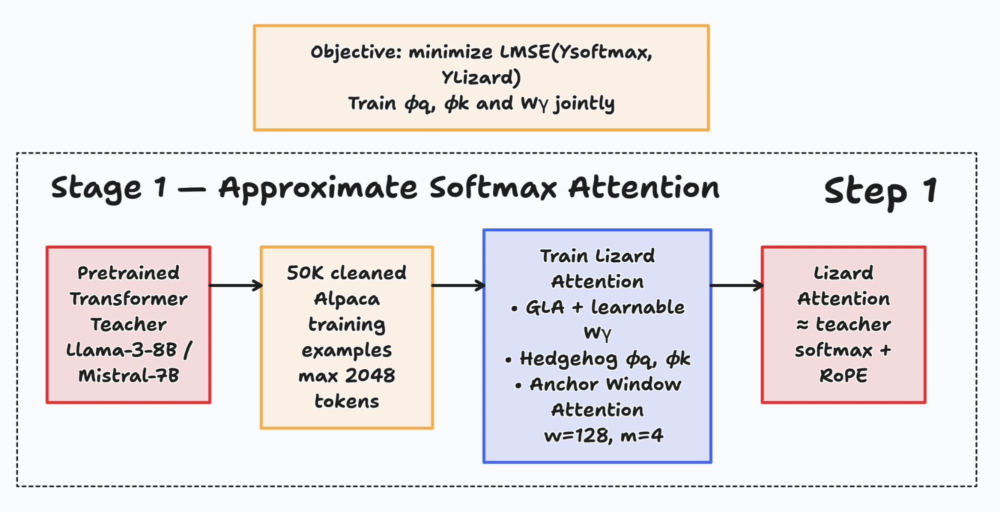
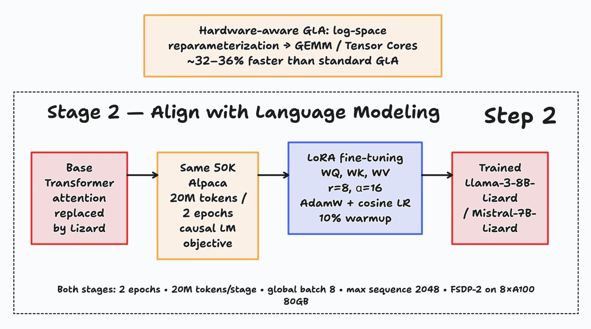

# Figures

Figures for the thesis. Each figure has a caption and a check against these notes. The figures came into the notes on 2026-10-06. The source of figures 1 and 2 (the two training stages) is a [tldraw board](https://www.tldraw.com/f/T5KBfJOv5daAR5rH1rYv3?d=v-219.-590.2124.1849.page).

| # | File | Contents |
|---|---|---|
| 1 | [lizard-stage1.webp](lizard-stage1.webp) | Stage 1 of the Lizard paper: approximate the softmax attention |
| 2 | [lizard-stage2.webp](lizard-stage2.webp) | Stage 2 of the Lizard paper: align with language modeling |

## Figure 1: stage 1

**Caption:** Stage 1 of the Lizard paper. The teacher is Llama-3-8B or Mistral-7B. The data is 50K cleaned Alpaca examples of at most 2048 tokens. The Lizard attention has three parts. These are GLA with the learnable gate W_γ, the Hedgehog feature maps φ_q and φ_k, and the window branch (w = 128, m = 4). The loss is the MSE between the outputs of the softmax attention and of the Lizard attention.

| Point | Figure | These notes |
|---|---|---|
| Trainable parts | φ_q, φ_k and W_γ | The paper also calls the sink logits t_j and α learnable ([math formulas](../math-formula.md)). |
| Teacher | Llama-3-8B or Mistral-7B | This project uses Llama-3.2-1B. |
| Window | w = 128, m = 4 | The same in this project. The window branch has no RoPE ([document 15](../15-attention-math-side-by-side.md)). |

## Figure 2: stage 2

**Caption:** Stage 2 of the Lizard paper. The model with Lizard in place of the softmax attention trains with the causal language modeling loss. The data is the same 50K Alpaca examples (20M tokens, 2 epochs). LoRA trains W_Q, W_K and W_V (r = 8, α = 16), with AdamW and a cosine learning rate with 10% warmup. The top box gives the hardware-aware GLA of the paper. The bottom line gives the settings of both stages.

| Point | Figure | These notes |
|---|---|---|
| LoRA | W_Q, W_K, W_V, r = 8, α = 16 | The same as the paper ([document 9](../09-paper-comparison.md)). Runs 1 and 2 of this project also trained o. |
| Optimizer and schedule | AdamW, cosine, 10% warmup | The same as the paper ([document 9](../09-paper-comparison.md)) |
| Data, batch and length | 2 epochs, 20M tokens for each stage, global batch 8, 2048 tokens | The same as the paper and this project ([document 9](../09-paper-comparison.md)) |
| Hardware-aware GLA | Log space, GEMM on Tensor Cores | This project does not use it for training ([math formulas](../math-formula.md), section 5). |
| Speed | ~32–36% faster than standard GLA | Not in these notes. Check it against the paper before use. |
| Hardware | FSDP-2 on 8 × A100 80GB | [Document 11](../11-gap-analysis.md) gives FSDP-2. The 8 × A100 are not in these notes. This project used one H200 ([document 2](../02-compute-and-cost.md)). |
